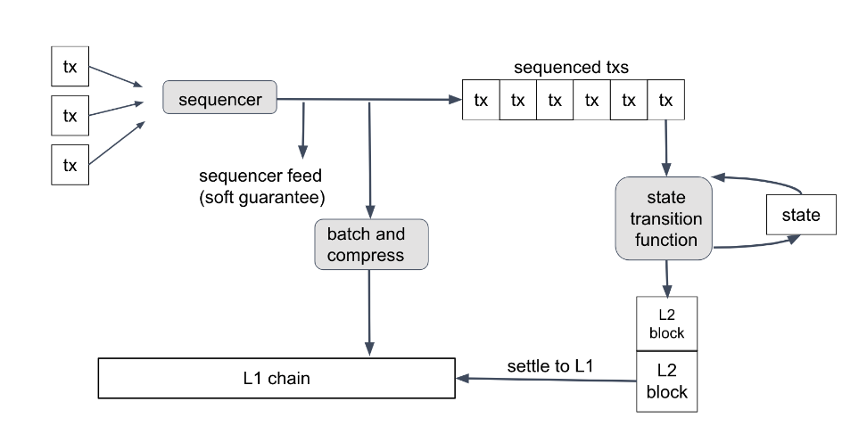
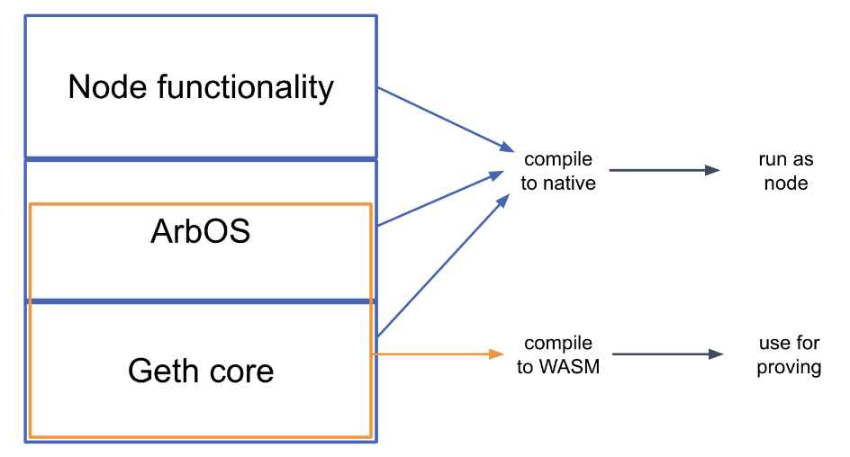
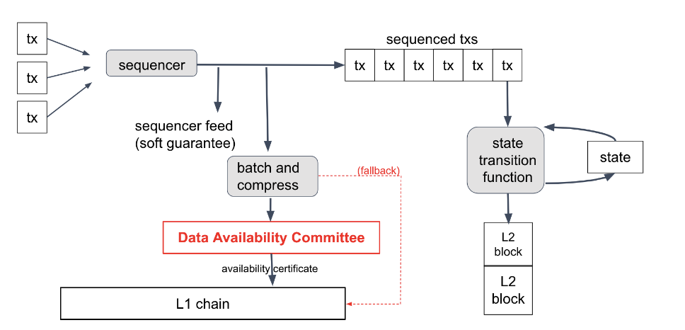

# Arbitrm Nitro 中文白皮书

## 摘要

我们推出了Arbitrum Nitro，这是第二代Layer 2区块链协议。Nitro比之前的Rollup方案提供更高的吞吐量、更快的最终性和更高效的争议解决。Nitro通过几个设计原则实现了这些特性：将交易的排序与确定性执行分离；将现有的以太坊仿真软件与扩展功能相结合，实现跨链功能；将执行和证明分别编译，使得执行速度快且证明结构化且与机器无关；并使用基于交互式欺诈证明的乐观Rollup协议将交易结果结算到底层的Layer 1链上。

## 1 介绍

在之前的工作中，我们描述了Arbitrum [9]，这是一个用于提高智能合约性能和可扩展性的系统和协议。本文描述了Arbitrum Nitro，这是一个显著改进的设计，相比原始版本具有更高的效率、更低的延迟、更强的活性保证和更好的激励兼容性。

### 1.1 Arbitrum Nitro的特性

​	Nitro支持智能合约的执行。该系统是在以太坊[14]之上实现的“第二层”，尽管原则上它可以在任何支持至少基本智能合约功能的区块链系统上实现。兼容链：Nitro运行在以太坊虚拟机（EVM）代码中部署的智能合约应用程序，并且Nitro节点支持与普通以太坊节点相同的API。

Nitro协议确保了第二层链的安全性和进展，前提是（1）底层以太坊链是安全且活跃的，以及（2）至少
Nitro协议中的一个参与者表现得很诚实。该协议被称为“乐观”，因为当各方按照他们的激励行事时，执行效率更高。

一种名为AnyTrust的Nitro变体，以降低成本为代价提供了额外的信任假设。本文的主体部分描述了常规的Nitro，而AnyTrust的差异在第7节中进行了描述。

Nitro自2022年8月31日起已在Arbitrum One链上部署，以以太坊作为底层第一层。Nitro的源代码可在https://github.com/offchainlabs/nitro及其子模块中找到。

### 1.2 设计方法

Nitro的设计具有四个独特的特点，我们将利用这些特点来组织演示。

- 顺序执行后的确定性执行：Nitro在处理提交的交易时分为两个阶段。首先，它按照将要处理的顺序将交易放入序列中，并对该序列进行确认。其次，它按照顺序对每个交易应用确定性状态转换函数。
- Geth的核心：Nitro中的核心执行和状态维护功能由开源的go-ethereum（“geth”）软件包中的代码处理，该软件包是最受欢迎的以太坊执行层节点软件。通过将geth代码编译为库，Nitro确保其执行和状态与以太坊高度兼容。
- 将执行与证明分离：Nitro为其状态转换函数编译了两个目标的代码。当在Nitro节点的普通操作中使用时，该代码被编译为本地执行代码。同样的代码也被编译为可移植的WebAssembly（“wasm”）[13]代码，用于欺诈证明的使用。如有需要，可以使用协议。这种双重目标的方法确保执行速度快，同时证明是基于结构化的、与机器无关的代码。
- 基于乐观 Rollup 和交互式欺诈证明的 Nitro：在原始的 Arbitrum [9] 设计基础上，Nitro 使用了改进的乐观 Rollup 协议，该协议基于优化的基于解剖的交互式欺诈证明协议。

### 1.3 论文结构

本文的剩余部分结构如下。第2节介绍了顺序控制器和确定性状态转换函数。第3节描述了Nitro软件的结构以及它为支持第2层链提供的功能。第4节描述了用于证明执行结果的代码的结构和推导过程。第5节介绍了用于断言执行结果的协议，第6节描述了挑战子协议，用于解决有关这些结果的任何争议。第7节介绍了使用外部数据可用性委员会的Nitro扩展——AnyTrust。第8节总结并提出未来的方向建议。

## 2 序列化后的确定性执行

Nitro中提交的交易处理分为两个阶段。首先，一个名为Sequencer的组件将交易按顺序排列并承诺顺序。其次，交易按顺序被确定性状态转换函数消耗。该过程如图1所示。

提交的交易可能有效，也可能无效。例如，它们可能缺少有效的签名，或者它们可能是垃圾数据。一个诚实的序列器将尽力丢弃无效的提交交易，但协议不假设序列器输出的交易是否有效。对无效交易执行状态转换函数将简单地丢弃该交易。

### 2.1 顺序控制器

顺序器只被信任按照先到先服务的原则诚实地排序传入的交易。目前，顺序器是由Offchain Labs运营的集中式组件，但在未来，我们打算过渡到基于委员会的顺序器，使用公平的分布式排序协议[11, 10]。

> 原则上，顺序控制器可以实现任何交易排序策略。先到先服务的策略易于实施且最大程度地减少延迟。

Sequencer无法阻止链的进展，也无法阻止特定交易的包含。

顺序控制器以两种方式发布其交易排序。首先，它发布一个实时的交易序列，任何一方都可以订阅。该序列代表了顺序控制器最终按照特定顺序记录交易的承诺。顺序控制器有能力履行承诺，因此任何与承诺顺序不符的偏差可能是由于顺序控制器的故障或恶意行为，或者是Layer 1链的深度重组所致。

其次，Sequencer将其交易序列作为以太坊calldata发布。Sequencer收集一批连续的交易，使用通用的压缩算法（目前为brotli [1]）对其进行压缩，并将结果传递给运行在L1以太坊上的Nitro链的Inbox合约。这些批次代表了最终和权威的交易排序，因此一旦Sequencer的交易在以太坊上对Inbox具有最终性，Nitro链的交易序列就是最终的。

**延迟收件箱** 尽管大多数用户交易将直接提交给Sequencer并包含在Sequencer的批次之一中，但还有另一种提交交易的方式，即通过延迟收件箱。这有两个目的。首先，它允许L1以太坊合约提交交易，这些合约无法生成通过Sequencer提交交易所需的数字签名。其次，它为任何人提供了一种备用方法，以防Sequencer开始审查有效交易。

通过在Nitro链的收件箱合约上调用方法，可以将交易添加到延迟收件箱中。合约会保留一个时间戳交易的队列。序列生成器可以在其序列中包含延迟收件箱队列中的第一条消息。一个诚实的序列生成器会在短暂的延迟后执行此操作，这个延迟足够长，以确保该消息到达延迟收件箱时不会被L1链的重组所抹掉，通常是10分钟的延迟。

然而，如果一条消息在延迟收件箱中停留了至少一个阈值时间段（目前为24小时），任何人都可以强制将该消息作为下一条包含在链式收件箱中，从而确保其执行。这个强制包含的步骤可以防止Sequencer进行审查，但只有在Sequencer恶意操作或长时间停机的情况下才会需要。

第3.2.3节详细介绍了角色的更多细节。

图1：Nitro中的交易处理。顺序器对交易进行排序，并将排序结果作为实时数据流和压缩数据批次发布到L1链上。排序后的交易通过确定性状态转换函数逐个进行处理，该函数更新链状态并生成L2块。这些块随后结算到L1链上。

### 2.2 确定性执行

在传入交易被排序之后，它们会通过Nitro的执行阶段进行处理，使用链的状态转换函数（STF）。STF的输入是一个状态（通常是以太坊状态树的根哈希[14]），以及一个传入的消息，通常是一笔单独的交易。STF的输出是一个更新后的状态和一个新的与以太坊兼容的区块头，将被附加到Nitro链上。

STF是完全确定性的，因此在执行STF时，其结果仅取决于交易的数据和交易之前的状态。因此，交易T的结果仅取决于Nitro链的创世状态、T之前的交易序列以及T本身。

由于这种决定论，一个诚实的参与方可以根据仅有的交易序列或过去某一时刻链的确认状态和此后的交易序列来确定链的完整状态和历史。节点无需通信，也无需达成共识，就能够就正确的状态和历史达成一致，因为这仅取决于对所有人可见的交易序列。

Nitro确实有一个卷起子协议（在第5节中讨论），用于向L1以太坊链确认交易结果。该子协议并不决定交易的结果，而只是确认并记录已经为诚实的协议参与者所知的结果。

## 3 软件架构：Geth的核心

Nitro的第二个关键设计理念是“核心是geth”。这里的“geth”指的是以太坊最常见的执行层节点软件go-ethereum。正如其名称所示，go-ethereum是用Go语言编写的，几乎所有的Nitro也是如此。

构成Nitro节点的软件可以看作是由三个主要层次构建而成，如图2所示。

- 基础层是geth的核心，它模拟执行EVM合约并维护构成以太坊状态的数据结构。Nitro将此代码编译为库，并进行了一些小的修改以添加必要的钩子。
- 我们称之为ArbOS的中间层是一种定制软件，它提供与第二层功能相关的额外功能，例如解压和解析Sequencer的数据批次，计算第一层的燃气成本并收取费用以进行补偿，并支持跨链桥接功能，例如从L1存入以太币和代币，以及将其提取回L1。
- 顶层由节点软件组成，主要来自于geth。它处理与客户端的连接和传入的RPC请求，并提供操作以太坊兼容区块链节点所需的其他顶层功能。

图2：Nitro代码的高级结构，显示主要组件。状态转换函数的边界以橙色显示。

由于顶部和底部层大量依赖于geth的代码，因此这种结构被称为“geth三明治”。

状态转换函数由底层的geth层和部分中间的ArbOS层组成。特别地，STF是源代码中的指定函数，并隐含包括该函数调用的所有代码。STF以收到的交易字节作为输入，并可以访问可修改的以太坊状态树副本。执行STF可能会修改状态，并在最后发出一个新区块的头部（以以太坊的区块头格式），该区块将附加到Nitro链上。

### 3.1 ArbOS

ArbOS是一个软件层，实现了管理第二层链所必需和方便的功能。这包括记账功能、跨链通信以及L2特定的费用追踪和收集。

> 严格来说，geth在三明治中扮演面包的角色，而ArbOS则是馅料，但这个三明治以面包命名。

ArbOS的部分内容包含在状态转换函数中。

### 3.1.1 状态表示

所有Layer 2 Nitro链的状态都存储在以太坊的Merkle Patricia状态trie数据结构中。这包括ArbOS的状态，它作为状态转换函数的一部分被修改。

ArbOS将其状态编码在一个特殊的以太坊账户的存储槽中，该账户的私钥是未知的。所选择的特定槽位是为了满足以下目标。

- 将所有ArbOS状态保存在单个以太坊账户的存储中
- 允许ArbOS的子组件独立管理其状态，避免冲突
- 在同一子组件内保持合理的局部性，并
- 避免限制未来对状态的添加。

State被组织成一个嵌套的“空间”层次结构，每个空间都是从256位索引到256位值的映射，所有值都隐式初始化为零。这个结构被映射到一个单一的扁平的256位到256位的键值存储中，这就是特殊以太坊合约的存储。

每个空间都与一个键关联。根空间的键是零，而在键为k的空间中命名为n的子空间的键是H(k||n)，其中H是以太坊的标准Keccak256哈希函数。该方案确保空间的键不会发生冲突。

在具有密钥k的空间中，索引为i的项目存储在底层平坦存储中的位置H(k||i)，其中H是一个保持局部性的哈希函数。函数H(x)对x的除最后8位以外的所有位进行哈希运算，将结果截断为248位，然后附加上x的最后8位。这样可以确保哈希函数保持256个索引的连续性，并确保函数具有抗碰撞性。当以奖励连续性的状态表示切换到以太坊时，使用这种保持局部性的哈希函数将降低状态访问的成本。

### 3.2 跨链互操作

ArbOS的其中一个作用是支持Nitro和Layer 1以太坊之间的安全跨链调用。一个层上的账户可以向另一个链发送交易，而该交易将被异步执行。在本节中，我们将介绍Outbox，它支持从Nitro链向以太坊的调用，以及两种机制，即Inbox和Retryable Tickets，它们支持从以太坊向Nitro链的调用。

#### 3.2.1 地址别名化

当一个以太坊第一层合约向Nitro链提交交易时，就会出现一个问题，即在Nitro上运行时应该附加哪个发送者地址到交易中。很容易地，我们可以简单地使用发送合约的L1地址，但是在Nitro链上可能存在相同地址的合约，如果是这样的话，对于Nitro上的调用接收者来说，这两个合约将无法区分，这将允许其中一个在Nitro链上冒充另一个。这是潜在的危险。

为了避免这种情况，在第一层上，L1发送者的地址A在Nitro链上被表示为f(A) = (A + C) mod 2，其中C是一个指定的奇数常数。因为所有以太坊地址和其他Nitro地址都是通过对某些数据进行哈希生成的（具体数据取决于地址的来源），所以几乎不可能在别名地址和另一个Nitro地址之间生成冲突。当与以太坊进行交互时，Nitro软件会根据需要双向转换地址。

3H'相比于H，失去了一些碰撞抵抗的位数,通过蛮力搜索，找到碰撞的努力减少了2倍，但这种减少是可以接受的。

#### 3.2.2 OutBox

Nitro的Outbox系统允许进行任意的L2到L1合约调用；即，在L2上发起的消息最终在L1上执行。鉴于乐观Rollup的安全属性，出站消息的L1执行只能在其争议期过去并确认其Rollup区块后进行（如第5节所述）。

从逻辑上讲，L2到L1的消息就像是在L2上创建的一个“票”，可以在L1上“兑换”，以引发在L1上发生指定的事务调用。该事务调用的接收方可以验证它是一个经授权的L2到L1的消息调用，并确认调用的L2发送者和数据。这个功能足以支持从L2到L1的ETH、代币或其他形式的价值的安全转移。异步票据模型是为了安全起见。消息必须是异步的，因为在包含它们的RBlock得到确认之前，它们不能被兑换；而且兑换是按照票据而不是严格的顺序进行的，因为兑换特定的票据可能需要执行任意代码，这可能在L1的gas中非常昂贵，甚至不可能。

L2到L1的消息是通过调用ArbOS中的特殊ArbSys预编译来发起的L2事务。ArbOS将L2发送者的地址、提供的ETH数量、L1目标地址和calldata进行序列化，结果成为L2到L1的消息。

RBlock所声明的状态的一部分是链历史中所有L2到L1消息的Merkle树的根哈希。当确认一个RBlock时，该根哈希会在L1上的链Outbox合约中进行更新；此时，用户可以使用包含消息的Merkle证明调用Outbox合约来兑换消息。L1的Outbox合约会跟踪已成功兑换的消息，以确保每条消息最多只能兑换一次。

ArbOS使用高效的表示方法来支持Merkle树根的增量计算，同时只需要对数级的存储空间。任何Merkle树都可以分解为一组最小的完全二叉子树，其大小逐渐减小。ArbOS仅记住整个Merkle树的大小，以及这些完全子树的根哈希。向树中添加新叶子将导致一个状态，其中只有一个以前不存在的完全子树。ArbOS发出一个包含新创建子树哈希的L2 EVM事件。Merkle树版本中的每个包含证明都由一组这些子树哈希组成，想要创建证明的客户端可以使用标准事件搜索来找到包含其证明所需哈希的L2事件。（Nitro节点API包括自动构建这些证明的支持。）

#### 3.2.3 Inbox

收件箱由一组Layer 1以太坊合约管理，负责记录发送到Nitro链的消息（通常是交易）。延迟收件箱接收在Layer 1上提交的消息，而主收件箱接收由顺序器发送的消息，并合并延迟收件箱中的消息。

延迟收件箱是一组Layer 1以太坊合约，用于接收要传递到Nitro链的消息。这是一种替代通过Sequencer提交的方式。延迟收件箱是Layer 1合约提交消息的唯一方式，因为Layer 1合约无法对消息进行签名或将其提交给Sequencer。它还为任何用户提供了一种在Sequencer不可用或行为不当的情况下提交消息的方式。

延迟收件箱在逻辑上是一个队列。它跟踪提交给它的消息数量，并对这些消息的内容进行哈希链承诺。如下所述，这些消息最终将被复制到主收件箱中。

顺序控制器直接将其数据批次提交给收件箱合约。每个批次包含一系列压缩的交易，以及一个指令，要求从延迟收件箱的头部包含指定数量的消息。ArbOS的主输入循环将按顺序消耗这些顺序控制器批次。

一个表现良好的Sequencer会在短暂延迟后将延迟的收件箱消息包含进来，这个延迟足够长，以最小化第一层链的重新组织可能导致包含的消息消失或改变的风险。当前的Sequencer实现在十分钟后包含延迟的收件箱消息。如果Sequencer在固定时间间隔内未能包含延迟的收件箱消息，任何一方都可以调用收件箱来强制包含该消息，这是通过将包含该消息的Sequencer批次强制放入收件箱来实现的。能够将消息提交到延迟的收件箱并强制其包含，而不依赖于Sequencer，支持Nitro对活力的保证。

#### 3.2.4 可重试的Tickets

第一层合约可以向Nitro链提交交易，但这些交易在Nitro链上必须异步运行，因此提交的第一层交易无法查看其是否成功。这对于令牌桥接等应用程序带来了问题。

> 设置此参数反映了追求及时包含的愿望与避免序列器出现故障时出现意外行为之间的权衡。目前设置为24小时，但随着对序列器停机风险的感知降低，我们预计该值将会减少。

需要一个第一层合约来确保存款交易在第二层运行。如果存款交易失败，例如由于燃气价格的变化，第一层桥接合约直到很久之后才能知道这一点，而用户资金可能会在此期间丢失或被困住。

为了支持这个和其他的使用情况，Nitro包括了一个可重试的票据系统，它允许从第一层提交的交易被指定为可重试，这意味着如果交易失败，ArbOS会为该交易创建一个可重试的票据。如果交易附带了ETH的调用价值，ArbOS会将该调用价值托管起来，并与该票据相关联。稍后的交易可以通过为其提供燃料资金来兑换该票据。重试将使用原始发送者、调用价值和数据运行，唯一的区别是燃料参数和支付燃料的人。

如果重试失败，票据将保留在重试缓冲区中，可以再次进行重试。（如果重试成功，票据将被移除。）在固定的时间间隔后，目前为一周，未兑换的票据将过期，并由ArbOS自动删除。如果被删除的票据在ArbOS中有托管的通话价值，该通话价值将被退还。

可重试交易的提交者必须支付提交费用，如果交易的初始执行成功，提交者将获得退款；如果交易的初始执行失败并生成了可重试的票据，则提交费用将支付给ArbOS。提交费用旨在覆盖将票据保留在ArbOS存储中直到过期时间的成本。提交费用取决于交易的大小，并由第一层合约确定，以确保第一层提交者确切地知道费用的金额。

#### 3.2.5 令牌桥

Nitro的跨链消息功能可用于创建Token Bridge，这是一种应用程序，允许在以太坊和Nitro链之间有效地转移资产。Offchain Labs团队已经实施并发布了一个非正式称为“canonical”的Token Bridge，尽管Nitro核心协议并未对其给予特殊认可或功能；它实际上就像任何其他应用程序一样。（请注意，类似地，Nitro没有本地认可的令牌概念，也没有任何特定的令牌标准，就像以太坊一样。）

在其核心，Token Bridge提供了存入（从以太坊到Nitro的转账）和提取（从Nitro到以太坊的转账）可替代代币的能力。要存入n个代币，需要向以太坊发送一笔交易，该交易执行两个操作：将n个代币发送到一个L1合约（称为Token Gateway），并创建一个可重试的交易（第3.2.4节），该交易铸造n个L2对应合约的代币。这两个代币合约是对应的，因为它们保证了持有者的身份。

L2代币可以进行提现：通过L2交易发起提现m个代币，该交易会在L2上销毁m个代币，并创建一个L2到L1的消息（第3.2.2节），指示L1代币网关在L1上释放m个代币。确认后，该消息可以在出箱中执行，从托管中释放m个代币。

默认情况下，令牌通过“标准网关”合约进行桥接。当通过标准网关进行桥接时，令牌会在L2上以确定性生成的地址（通过CREATE2 EVM操作码）部署其L2对应令牌。在L2上部署的令牌合约是一个StandardArbERC20，它是一个OpenZeppelin ERC20合约，具有额外的功能，可以从桥接合约中铸造/销毁令牌，并提供回调钩子功能。另外，为了使用不同的合约作为其L2对应令牌，L1令牌合约可以将自身注册到任何其他“自定义”网关上。网关路由合约负责跟踪L1令牌与其网关之间的映射（而网关又将其映射到其L2对应令牌）。

理论上有许多额外的令牌桥接功能是可能的，包括非同质化令牌桥接、快速L2到L1提款的原子交换，以及将原生部署在L2上的令牌桥接回L1。几个独立的服务提供增强的桥接功能，通常是在基本桥接的基础上构建的。

#### 3.3 燃气和费用

与许多区块链一样，Arbitrum从每笔交易中收取费用，以支付链的运营成本，调整激励机制，并在需求高时进行资源分配。费用以特定于链的gas形式收取和收集。为了清晰起见，我们将使用NitroGas一词来表示Nitro链上的Layer 2 gas，使用L1Gas一词来表示以太坊上的Layer 1 gas。在这两个链上，每个EVM指令的gas单位成本相同；例如，MULMOD指令在Nitro上的成本为8 NitroGas，在以太坊上的成本为8 L1Gas。

每个交易都需要一定数量的NitroGas，取决于交易所使用的资源。NitroGas的价格等于当前的基础费用，该费用根据以下算法进行变化。NitroGas的价格和支付以ETH计价。

Nitro交易指定了一个气体限制，即它允许消耗的最大NitroGas数量。如果交易尝试消耗超过其限制的NitroGas，交易将失败，但必须支付所使用的NitroGas。交易还指定了它愿意支付的最大基础费用。如果当前的基础费用高于交易的最大值，交易将不会运行（因此也不会消耗NitroGas）。这些规则共同确保了交易的NitroGas消耗。

花费不能超过其燃气限制和最大基础费用的乘积。通过签署交易，用户授权从其ETH账户中扣除燃气费用，最高不超过此金额，而Nitro将遵守此限制。

这种方法保留了以太坊的用户体验，允许开发者和用户使用标准工具和钱包。

#### 3.3.1 L2燃气计量和定价

与以太坊类似，Nitro跟踪NitroGas的使用情况，并根据使用情况动态调整其基础费用，以便在需求超过链的可持续容量时，基础费用增加，直到需求和容量重新平衡。

链的可持续能力体现在链的速度限制参数上，该参数反映了链的最大可持续吞吐量，基于实际工程考虑。NitroGas的使用允许在短时间内超过速度限制，但定价算法必须确保NitroGas的平均使用量在长时间内不超过速度限制。

与以太坊不同，Nitro的区块之间的时间是可变的，因此Nitro的基础费用调整算法以一秒为粒度进行操作，而不是像以太坊一样以一个区块为单位。此外，在Nitro中，序列器会为交易附加时间戳，因此ArbOS必须准备好处理具有相同时间戳的大量交易，或者处理请求相同时间戳的大量NitroGas。相比之下，以太坊将单个区块中的L1Gas使用限制在两倍以太坊的速度限制之内。

Nitro的气体计量算法跟踪积压量B，

- 如果一笔交易消耗了 G NitroGas，那么 B ← B + G。
- 如果经过T秒，B ← max(B − T S, 0)，其中S是速度限制。

直观地说，B跟踪链在当前使用高峰期间相对可持续速度限制的落后程度。然后，Nitro的基础费用被计算为

F(B) = F0e0

其中F0是最小的基础费用，B0是一个容差参数。比例因子β被选择为使得在一个12秒的时间段内，燃气使用量超过速度限制的两倍，将会使基础费用乘以一个因子。

ing β ≈ 102S

以太坊将会观察到，如果它以两倍于其速度限制的12秒区块运行。

基础费用的指数增长，作为积压的函数，确保了实际上积压是有限的。如果需求曲线不变，且需求

如果超过最低基本费用的速度限制，那么基本费用将在需求等于速度限制的水平上达到平衡，而积压量将以对数形式随平衡价格保持恒定。

#### 3.3.2 L1数据计量和定价

除了第2层资源外，交易还使用了以太坊第1层的一些资源。这些资源必须包含在交易的总燃气费用中，以便能够收回成本并激励对齐。尽管这些第1层资源是以NitroGas计费的，但这些第1层费用在跟踪积压时不会被计入，因为它们不反映对Nitro链自身资源的消耗。

当Sequencer将以太坊交易提交到第一层并执行相关的簿记时，会产生相关成本。实际上，这通常是基于以太坊的Nitro链上成本的最大组成部分。

定价这些资源存在两个主要挑战。首先，如何将一批交易的成本分摊给组成它的各个交易并不明显。发布的数据使用通用压缩算法[1]进行压缩，其有效性取决于一批交易中共享的模式。理想情况下，我们会对对批次的可压缩性做出更大贡献的交易收取较少费用，但是没有明显且高效的方法来确定特定交易对整体可压缩性的贡献程度。因此，我们将采用下面描述的近似方法。

第二个挑战是，当交易被排序时，ArbOS必须知道对交易收取的L1费用，使用后来才可获得的信息将违反状态转换函数的确定性属性。但是在交易被排序时，并不知道它将被发布的批次的成本。最终的成本将取决于批次发布时的L1基础费用，以及批次的剩余内容（影响批次的大小和可压缩性），但在交易被排序时这些都是未知的。因此，我们无法指望根据交易的实际L1发布成本收取费用，因为在评估费用时这些成本尚未确定。

Nitro通过确定两个因素来解决这些挑战：（1）对于每个交易，以数据单位衡量的估计相对占用空间，以及（2）在每个时间点上，每个数据单位的费用。

> 5个AnyTrust链引发了其他问题，这些问题将在讨论中解决

分摊交易成本为了在交易之间分摊成本，我们通过将Brotli压缩器应用于每个交易，以其最低压缩/最便宜的计算级别，来近似估计每个交易的可压缩性，并将结果的大小乘以16。我们在最快的设置下使用Brotli以减少计算负载，因为这个计算是在状态转换函数内部进行的，实际上是链的一项开销成本。这个压缩数据的大小是对使用更激进的压缩器构建Sequencer批次时压缩的同一交易的大小的近似。而这又是对交易对整个批次可压缩性的贡献的粗略估计。更准确的近似估计是可能的，但我们不知道一个更快速的更好的近似估计方法。

确定每个数据单位的成本，有人可能天真地认为，每个数据单位的成本应该等于L1基础费用，因为这是Sequencer支付的发布数据的费用。但这不是可行的方法，至少有两个原因。首先，ArbOS无法直接测量L1基础费用，我们也不相信Sequencer会报告L1基础费用，因为如果基础费用更高，Sequencer会获得更多的支付。其次，由于对交易收取的单位数量仅仅是对其整体数据占用的近似，所以收取的总单位数量与Sequencer的成本并不成比例。

数据的定价是使用一种自适应算法进行的，该算法旨在实现两个主要目标：最小化数据费用收取与Sequencer的数据成本之间的长期差异，并次要地避免数据价格的突然波动。

为了做到这一点，定价人员追踪以下内容：

- 序列器所欠款项
-  一个报销基金，接收所有L1费用交易所收取的资金
- 最近数据单元的计数，加上每个交易中的数据单元数量，以及
- 当前L1数据单元的价格，以wei为单位。

根据这些数据，定价器会自适应地调整L1数据单价。

> 
> 我们乘以16是因为以太坊对大多数数据每字节收取16个gas，因此数据单位的数量是根据以太坊上数据的gas成本进行衡量的。
>
> 在实践中，允许除了顺序器之外的“批量发布者”发布数据，并将批量的报酬直接支付给发布该批量的批量发布者。部署的系统支持这一点，但在正文中，我们将假设顺序器是唯一的批量发布者，以简化说明。

当Sequencer将一批次发布到L1收件箱时，这会导致L1收件箱向链的延迟收件箱插入一个“批次发布报告”事务。经过一段延迟后，该事务将由定价器进行处理，具体如下。

1. 定价器计算报告批次的邮寄成本，并将该金额加到应付给排序器的金额上。
2. 定价器计算分配给此更新的数据单元数量，即 Uupd = U T −TprevU是最近数据单元的计数，T是当前时间，Tupd是更新发生的时间，Tprev是上次更新发生的时间。Uupd从U中减去。
3. 定价者从报销基金中支付给排序器，支付的金额为排序器所欠款项和报销基金余额的最低值。支付的金额将从报销基金和排序器所欠款项中扣除。
4. 定价器计算当前的剩余资金S，即偿付基金余额减去应付给排序器的金额。（剩余资金可能为负数。）然后计算剩余资金的导数，记为D = Uupd。
5. 定价器将“导数目标”计算为 D =在处理额外的E个数据单元后，为了使剩余量达到零，必须保持的平均导数。
6. 定价器计算价格变化为∆P = (D − D) α+Uupd，其中α是平滑参数。
7. 定价器将价格更新为 P = max(0, Pprev + ∆P)。

该算法应该使顺序控制器的长期补偿几乎等于其长期成本。我们还可以添加一个小的按单位奖励，支付给任意地址，以支付基础设施或运营所需的其他小额支付。

## 4 编译执行与证明

设计实用的卷取系统面临的挑战之一是在普通执行中希望系统表现良好，同时能够可靠地证明执行结果之间的紧张关系。Nitro通过使用相同的源代码进行执行和证明来解决这个问题，但是针对这两种情况编译成不同的目标。

在编译Nitro节点软件以进行执行时，使用普通的Go编译器，为目标架构生成本机代码，当然对于不同的节点部署，目标架构也会不同。（节点软件以源代码形式分发，并作为包含已编译二进制文件的Docker镜像。）

另外，代码中的状态转换函数部分由Go编译器编译为WebAssembly（wasm），这是一种类型化的、可移植的机器码格式。然后，wasm代码经过简单的转换，生成我们称之为WAVM的格式，具体细节如下所述。如果对计算STF的正确结果存在争议，将通过一种交互式欺诈证明协议（在第5节中描述）参考WAVM代码来解决。

### 4.1 WAVM

wasm格式具有许多特性，使其成为欺诈证明的良好载体——它具有可移植性、结构化、规范明确、设计用于执行不受信任代码的受控方式，并且具备相当不错的工具和支持。但是，为了完全完成工作，它需要进行一些修改。我们定义了一个稍微修改过的wasm版本，我们称之为WAVM。一个简单的转换阶段将编译器生成的wasm代码转换为适合证明的WAVM代码。

WAVM与wasm在三个主要方面有所不同。首先，WAVM移除了一些由Go编译器生成的wasm特性；转换阶段会验证这些特性是否存在。

其次，WAVM限制了一些wasm的功能。例如，WAVM不包含浮点指令，因此转换器将浮点指令替换为对Berkeley SoftFloat库的调用[8]。WAVM不包含嵌套控制流，因此转换器将控制流结构展平，将控制流指令转换为跳转指令。一些wasm指令执行所需的时间是可变的，我们通过将其转换为使用固定成本指令的结构来避免这种情况。这些转换简化了证明过程。

第三，WAVM添加了一些操作码，以便与区块链环境进行交互。例如，新的指令允许WAVM代码读取和写入链的全局状态，从链的收件箱获取下一条消息，或者向执行状态转换函数成功结束发出信号。

> 我们使用软件浮点数来降低不同架构之间的浮点数不兼容性风险。核心Nitro函数不使用浮点数，但Go运行时使用了一些浮点数。

### 4.1.1 读取预图像指令

最有趣的新指令是ReadPreImage，它接受一个哈希H和一个偏移量I作为输入，并返回在H的原像中偏移量I处的数据字（以及返回的字节数，如果I在原像的末尾或之后，则为零）。当然，通常情况下无法从任意哈希值生成原像。为了安全起见，ReadPreImage指令只能在公开已知原像且原像大小已知不超过约110千字节的情况下使用。

作为一个例子，以太坊的状态树格式中维护了Nitro链的状态，该格式以Merkle树的形式组织。树的节点存储在数据库中，由节点的Merkle哈希进行索引。在Nitro中，状态树保存在STF的存储之外，STF只知道树的根哈希。通过使用ReadPreImage，STF可以根据树节点的哈希恢复树节点的内容，这依赖于树的完整内容是公开已知的事实，并且以太坊状态树中的节点始终小于预映像大小的上限。通过这种方式，STF能够任意读取和写入状态树，尽管只存储了根哈希。

ReadPreImage的唯一其他用途是根据头哈希获取最近L2块头的内容。这是安全的，因为块头是公开已知的，并且具有有限的大小。

这种“哈希预言技巧”是将数据结构的默克尔哈希存储起来，并依赖于协议参与者存储完整的结构，从而支持通过哈希获取内容。这个技巧最初源自原始的Arbitrum设计[9]。

### 4.2 WAVM 模块

WAVM还允许虚拟机组合多个wasm二进制文件，称为模块。每个模块都维护着自己的代码、全局变量和内存。模块可以通过CrossModuleCall WAVM指令调用其他模块，被调用者可以读写调用者的内存以在它们之间传递数据。这使得用Rust编写的引导程序、用Go编写的状态转换函数以及用C编写的各种库都可以在同一个WAVM机器上运行。如果没有模块系统，Go的内存管理将干扰C的内存管理，但模块系统使它们能够维护各自独立的内存。

> 在这个背景下，“公开已知”信息是指任何诚实方都可以通过假设L1以太坊链的完整历史可用来有效地推导或恢复的信息。为了方便起见，哈希原像也可以由第三方（如公共服务器）提供，并且所提供的值的正确性很容易验证。

### 4.3 一步证明

WAVM指令集的设计使得可以验证执行单个WAVM指令的“一步证明”。给定一个初始状态的哈希值、一个最终状态的哈希值和一个有限大小的证明，以太坊合约可以验证从具有初始哈希值的状态执行单个指令将产生具有最终哈希值的状态。

为了证明目的，WAVM状态的哈希值是通过对WAVM/wasm虚拟机状态进行特定的Merkle哈希计算得出的，更详细的描述请参见第6.1.3节。

## 5 乐观 Rollup 协议

Rollup协议是Nitro在L1以太坊链上确认L2链状态和相关数据的方法。这对于L1链上的合约以及不想与L2链进行交互的参与方非常有用。但是L2用户通常不会等待L1的确认，而是依赖确定性状态转换函数，该函数允许从记录的交易序列中推导出交易结果。

Rollup协议生成一系列Rollup块（“RBlocks”），它们与L2块不同。简而言之，一个RBlock通常封装了一系列L2块，因此RBlocks比L2块要少得多。RBlock的边界不需要与Sequencer批次的边界对齐，通常也不对齐。

一个RBlock包括：

- 一个L2块编号
- 该编号的L2区块的头哈希值
-  在该L2区块中消耗的链上传入消息数量
- 该L2区块及之前链中发出的发件箱消息的摘要
- 一个指向前任RBlock的指针，以及

根据下面描述的协议，根据需要提供额外的簿记信息来跟踪RBlock的状态。

最初，一个RBlock只是代表某方声称RBlock的数据是正确的。最终，每一个这样的声称要么会被协议确认，要么会被拒绝并从RBlock链中删除。确认的RBlock集合将形成一个起始于单一链的链条。

> 10 这里的“messages”指的是个别交易，或类似的通信到L2链，而不是Sequencer批次。

随着创世RBlock的出现，并随着时间的推移不断增长。总体而言，RBlock链将由一条确认块的单一链组成，可能后跟一棵未确认的RBlock树。

如果满足以下条件之一，每个RBlock被认为是有效的：(a) RBlock已经确认，或者(b) 以下所有条件都为真：

- RBlock的L2块编号、头哈希、传入消息数量以及消息输出摘要都代表链的正确执行，以及
- RBlock的任何早于当前的兄弟节点都是无效的，
- 前任的RBlock是有效的。

根据定义，有效的RBlocks集合将形成一个单一的链，其中包含已确认的RBlocks集合作为前缀。

一方可以在特定的RBlock上进行押注，代表该方主张该RBlock是有效的。因为有效性意味着前一个RBlock的有效性，该方还在主张该RBlock的前一个RBlock以及一直追溯到创世RBlock的前任链都是有效的。

### 5.1 常见情况

各方应意识到，由于下文所述的原因，对无效的RBlock进行质押很可能会导致质押资金的损失，因此如果所有各方都按照自身的激励行事，只会创建有效的RBlock。这些有效的RBlock将形成一个延伸已确认RBlock链的单一链条。

如果确认了一个RBlock B，并且B只有一个有效的子节点，并且该子节点的发布时间距离一个定义的“挑战期”C已经超过了，那么该子节点可以被确认。因此，根据上述各方按照其激励行事的常见情况，如果在时间T发布了一个RBlock，则它将在T + C时被确认。

### 5.2 Challenges

如果两个参与方在同一个RBlock的不同继任者上进行质押，这些参与方可能会被置于挑战之中。质押在较旧继任者上的一方将为较旧继任者中的L2块编号的可行性以及与该块编号相关联的头哈希、传入消息计数和输出摘要的正确性进行辩护。另一方将试图证明其中一项是不正确的。

以下详细描述了挑战子协议。在整体的Rollup协议中，它的任务是确定两个争议方中的一方是否已经发出挑战。

一个虚假的声明（无论是在两个RBlocks中的其中一个上押注，还是在挑战子协议的某个阶段）。失败方的押金将从所有的RBlocks中移除。输家押金的一半给予赢家，另一半加入公共物品基金。

挑战子协议确保初始索赔有效的一方始终可以通过在每个挑战阶段提出有效的索赔来获胜。因此，一个诚实的一方（即始终提出有效索赔的一方）将赢得每一次挑战。由于诚实的一方最终将与每个不同意它的一方进行挑战，诚实的一方最终将消除所有不同意的一方，从而使整个协议得以进展。

## 6 挑战子协议

​	我们将在两个阶段中描述挑战协议。首先，我们将描述一个简化版本的协议，该协议是正确的但不够高效。然后，我们将描述一些改进措施以提高效率。为了简化说明，我们将忽略一些由真实协议处理的特殊情况。

挑战协议可以看作是Alice和Bob之间的一场游戏，以以太坊合约作为“裁判”，检查玩家的动作是否有效，并跟踪游戏状态。

游戏中包含了每位玩家的“棋钟”计时器。每位玩家的计时器最初设置为挑战时限。当轮到某位玩家行动时，该玩家的计时器开始倒计时。当玩家进行有效的移动时，其计时器暂停，对手的计时器恢复。如果某位玩家的计时器归零，该玩家将放弃挑战。

### 6.1 基本挑战协议

基本的挑战协议分为三个阶段。首先，对区块结果的争议被反复二分，将其缩小为对单个区块创建的争议。其次，将单个区块的争议转化为对一定数量的wavm计算步骤的争议，然后将该争议反复二分，将其缩小为对单个执行的争议。

> 
> 11 公共物品基金用于惠益整个用户社区，与挑战参与者的利益无关，因此我们可以假设如果押注金额为S，那么挑战对参与者来说是一个负和结果，为-
>
> 如果挑战中的双方都提出虚假声明，协议“不关心”谁赢得了挑战。一方将被确定为说谎者，而另一方将在虽然撒谎但仍然通过挑战。然而，押注在无效的RBlock上的一方最终将与诚实的一方进行挑战，并且会失败。整个协议的正确性论证并不假设挑战的赢家是诚实的，它只假设存在一个诚实的一方。

wavm指令。其次，Alice必须提供一步证明来证明她关于执行该单个wavm指令的主张。如果Alice能在这个过程结束时提供一个有效的一步证明，Alice就赢得了挑战；否则Bob获胜。

#### 6.1.1 阶段一：对块进行二等分

这个阶段发生在一系列的回合中。在每一轮开始时，Alice和Bob在某个块号B上达成一致，开始状态为SB，并且他们在块号B + N上对结束状态SN+B有不同意见，其中N > 1。现在，Alice需要声明中间块M处的状态SM，其中M = B + ⌊

接下来，Bob必须表明他是否同意或不同意Alice所声称的中间状态SM。现在有两种情况：

1. 如果Bob同意Alice的中间状态，协议就确定了一个较小的争议：Alice和Bob在SM上达成一致，但在SB+N = SM+N'上存在分歧，其中N = N - ⌊
2. 如果Bob不同意Alice的中间状态，协议已经确定了一个较小的争议：Alice和Bob在SB上达成一致，但在SB+N'上存在分歧，其中N' = ⌊

在这两种情况下，争议的规模大致减少了一半。重复相同的步骤，不断减半，直到 N = 1。这最多需要 ⌈log 2⌉ 次。

回合。

### 6.1.2 第二阶段：指令分割

在这个阶段的开始，Alice和Bob对于一个Nitro块存在分歧 - 他们在该块之前的块和状态上达成了一致，但在该块的内容或该块之后的状态或两者都存在分歧。这意味着他们对于单个状态转换函数的调用结果存在分歧。

Alice必须说明该调用执行了多少个wavm指令。假设她说执行了K个指令。现在，Alice和Bob对执行K个指令的结果存在分歧：他们对初始状态持相同意见，但对执行K个指令后的状态存在分歧。

协议现在模仿了第一阶段的二分协议，只是现在的二分是针对指令而不是块，并且状态是wavm虚拟机执行状态转换函数时的状态。最多经过⌈log 2⌉次后。

Alice和Bob将就执行单个wavm指令发生争议。

### 6.1.3 第三阶段：一步证明

在这个阶段的开始，Alice和Bob就wavm虚拟机状态的哈希达成了一致，但在执行一条wavm指令后，他们对wavm虚拟机状态的哈希存在分歧。

状态哈希是通过将虚拟机状态组织成一棵树，并计算树的默克尔哈希来计算的。

Alice必须在以太坊上调用一个一步证明验证合约，向其传递一个证人，使得合约接受她关于执行单个步骤的声明。验证合约的编写方式是，只有在已知前哈希的原像的情况下，才有可能找到一个成功的证人，当且仅当执行单个指令可以将虚拟机从具有前哈希的状态转换为具有后哈希的状态。

在我们的实现中，证人由表示之前状态的Merkle树的部分展开组成，验证者使用部分展开的状态树来读取下一条指令，模拟指令的执行，计算结果状态的Merkle根哈希，并将其与之后状态的哈希进行比较。

一步验证合约已编写完成，并定制了wavm指令集，以便始终能够使用可行的以太坊燃气量验证有效的证人。

如果爱丽丝能够提供一个有效的一步证明，她就赢得挑战。否则，鲍勃赢得挑战。

### 6.2 效率提升

在基本协议中，争议的二分阶段是交替进行的：主张者将其主张一分为二，然后挑战者选择一侧进行挑战，然后主张者再次一分为二，然后挑战者主张，如此往复。每个两步循环将争议中的指令数量减半。实际实现中采用的是d路切割而不是二分切割，但原则是相同的。

我们可以将步骤数量再减少一半，要求回应对手的解剖的一方不仅要确定挑战的d段是哪一段，还要提供将该段切割成d个子段的解剖，最终状态与对方所断言的不同。

这两个步骤一起减少了步骤的数量 从大约2log2d开始改进因子为2的对数

### 6.2.1 选择 d

实施该协议必须选择分解度d。纠纷解决的总成本是回合数logd(NK)乘以成本。

每轮的成本与α + d成正比，其中α是一个常数，因为链上交易的成本是一个常数加上与交易中发布的数据量成正比的项。此外，争议解决协议的每个步骤可能会对合约的执行造成固定的延迟；我们将这种延迟的总成本吸收到常数项α中。

总成本记录。我们通过差分法找到最优解。

将成本相对于d进行微分，并将结果设为零，结果是成本在满足d(ln(d) − 1) = α的d值上最小化，与N和K无关。给定特定的α值，可以通过数值方法找到最佳的d值。

## 6.3 正确性

为了证明协议仍然正确，我们必须展示一个诚实的一方无论是主张方还是挑战方，都能够在争议中获胜。

首先，我们要证明一个诚实的断言者可以赢得争议。如果爱丽丝做出了一个真实的断言，鲍勃对此提出质疑，鲍勃将不得不提出一个替代的断言，这个断言必然是错误的，因为它必须与爱丽丝的真实断言不同。当鲍勃推翻他的错误断言时，至少会有一个结果断言是错误的。爱丽丝可以对错误的断言提出质疑，并提供一个真实的断言作为替代，如此循环。在每个阶段，爱丽丝都可以做出真实的断言，从而迫使鲍勃做出错误的断言。

其次，我们展示了一个诚实的挑战者可以赢得争议。如果爱丽丝最初提出了一个虚假的断言，诚实的挑战者鲍勃可以提供一个真实的断言作为他的替代方案，将其分解为更小的真实断言。爱丽丝将不得不挑战其中一个真实的断言，提供一个必然是虚假的替代方案。这使得鲍勃可以再次回应一个真实的断言，如此往复。在每个阶段，鲍勃都可以提出真实的断言，从而迫使爱丽丝提出虚假的断言。

由此可见，一个诚实的一方总能赢得争议，而一个撒谎的一方总能被迫失败。

## 7 AnyTrust：具备外部数据可用性的Nitro

本节介绍了AnyTrust，这是Nitro的一个变种，通过接受一种较为宽松的信任假设来降低成本。AnyTrust支持已包含在Nitro代码库中，可以通过配置开关启用或禁用AnyTrust功能。

仲裁协议的正确性要求所有的仲裁节点都能够访问仲裁链收件箱中每个L2交易的数据。如上所述。

以上，标准的Nitro通过将数据（以批处理、压缩形式）作为calldata发布到L1以太坊上来提供数据访问。为此支付的以太坊燃气费用是Nitro成本中最大的组成部分。

AnyTrust依赖于一个外部的数据可用性委员会（以下简称“委员会”）来存储数据并根据需求提供数据。委员会由N个成员组成，其中AnyTrust假设至少有两个成员是诚实的。这意味着如果N-1个委员会成员承诺提供对某些数据的访问权限，那么至少有一个承诺方必须是诚实的，以确保数据可用，从而使整个Arbitrum协议能够正确运行。

在AnyTrust中，Sequencer避免将其批次数据发布到L1链上。相反，对于每个批次，它会发布一个数据可用性证书，其中包含数据的哈希值，证明具有该哈希值的批次数据可以从委员会获取，前提是至少有两个委员会成员是诚实的。

### 7. 1 Keysets

一个密钥集指定了委员会成员的公钥以及数据可用性证书有效所需的签名数量。密钥集使得委员会成员变更成为可能，并为委员会成员提供更改他们的密钥的能力。一个密钥集包含

- • 委员会成员的数量，以及
- • 每个委员会成员都有一个BLS公钥，以及
- 所需委员会签名的数量。

关键集通过它们的哈希值进行标识。

一个L1 KeysetManager合约维护着一个当前有效Keyset的列表。L2链的所有者可以向该列表中添加或移除Keyset。当一个Keyset变为有效时，KeysetManager合约会发出一个包含Keyset哈希和完整内容的L1以太坊事件。这使得内容可以稍后被任何人通过仅有Keyset哈希来恢复。

尽管API不限制同时有效的密钥集数量，但通常只有一个密钥集是有效的。

### 7.2 数据可用性证书

AnyTrust中的一个核心概念是数据可用性证书（以下简称“DACert”）。DACert包含以下内容：

• 数据块的哈希值，以及

- • 一个过期时间，和

图3：AnyTrust下的交易处理。序列化器将数据批次发送给数据可用性委员会，而不是将其发布到L1链上，并将生成的数据可用性证书发布到L1链上，而不是发布完整的数据。

• 证明足够数量的委员会成员已签署了（哈希值，过期时间）对

- 用于签名的密钥集的哈希值，以及

- 一个位图，显示哪些委员会成员签署了
- 一个BLS聚合签名[4]（基于BLS12-381曲线[3]）证明了这些参与方的签名。

由于2-of-N信任假设，DACert构成了区块数据的证明（即DACert中哈希的原像）将至少由一个诚实的委员会成员提供，至少直到过期时间。

在普通（非AnyTrust）的Nitro中，Arbitrum序列器将数据块作为calldata发布到L1链上。数据块的哈希由L1 Inbox合约承诺，使得L2代码能够可靠地读取数据。

AnyTrust给序列器提供了两种在L1上发布数据块的方式：可以像上面那样发布完整数据，也可以发布一个DACert证明数据的可用性。L1收件箱合约将拒绝使用无效Keyset的任何DACert；DACert的其他有效性方面由L2代码进行检查。

从收件箱中读取数据的L2代码与普通的Nitro一样，它会读取一个完整的数据块。如果它看到一个DACert

相反，它检查DACert的有效性，参考DACert指定的Keyset（因为L1 Inbox已经验证过，所以DACert在发布时是有效的）。L2代码验证以下内容：

• 签署者的数量至少达到密钥集所要求的数量，且

• 聚合签名对所声称的签署者有效，并且

• 到期时间至少在当前L2时间戳之后两周。

如果DACert无效，L2代码会丢弃DACert，并表现得好像收到了一个空批次。如果DACert有效，L2代码会读取数据块，因为DACert有效，所以数据块是可用的。

### 7.3 数据可用性服务器

委员会成员运行数据可用性服务器（DAS）软件。DAS公开了两个API：

• Sequencer API旨在仅由Arbitrum链的Sequencer调用，它是一个JSONRPC接口，允许Sequencer将数据块提交给DAS进行存储。部署通常会阻止除Sequencer之外的调用者访问此API。

• REST API旨在向全球提供服务，它是基于RESTful的HTTP(S)协议，允许通过哈希值获取数据块。该API完全可缓存，部署可以使用缓存代理或CDN来增加规模并防止DoS攻击。

只有委员会成员有理由支持Sequencer API。我们希望其他人通过镜像其他REST API服务器来运行REST API，这是有帮助的。

根据配置选项，DAS软件可以将其数据存储在本地文件中，或者在BadgerDB [6]数据库中，或者在Amazon S3上，或者在多个后备存储中进行冗余存储。该软件还支持在内存中进行可选缓存（使用Bigcache [2]）或在Redis [5]实例中进行缓存。

### 7.4 序列控制器-委员会互动

当Nitro序列器生成一个数据批次并希望通过委员会发布时，它会通过RPC同时将批次的数据和过期时间（通常是未来三周）发送给所有委员会成员。每个委员会成员将数据存储在其后备存储中，并以数据的哈希为索引。然后，成员使用其BLS密钥对（哈希，过期时间）对进行签名，并将签名返回给序列器。

一旦Sequencer收集到足够的签名，它可以聚合这些签名并为（哈希，过期时间）对创建有效的DACert。然后，Sequencer将该DACert发布到L1收件箱合约，使其在L2上的AnyTrust链软件中可用。

如果序列器在合理的时间内无法收集足够的签名，它可以放弃使用委员会，并通过直接将完整数据发布到L1链来“回退到Rollup”，就像在非AnyTrust链中所做的那样。L2软件可以理解两种数据发布格式（通过DACert或完整数据），并会正确处理每一种情况。

### 7.5 任何信任和L1定价

通过大幅减少相同数量交易所需的L1数据量，AnyTrust可实现交易数据价格的大幅降低。与普通的Nitro链一样，使用相同的L1定价算法（在第3.3.2节中描述），但在AnyTrust中，序列器的数据消耗要低得多（支付数据可用性证书的发布费用而不是完整数据），因此定价算法将对用户交易的每个数据单位评估更低的价格。如果AnyTrust链上的序列器回退到在第1层发布完整数据，那么它将报告更高的消耗，数据价格将上涨以进行补偿。

定价算法不需要任何更改；只是结果会有所不同。

## 8 结论

通过使用上述描述的设计，Arbitrum Nitro实现了高吞吐量，在一个可实现和部署的系统中提供了无需信任的安全和活跃性保证。当前的Nitro代码可以在https://github.com/offchainlabs/nitro上找到。我们将继续发展Nitro以提高性能并降低成本。

## Reference

