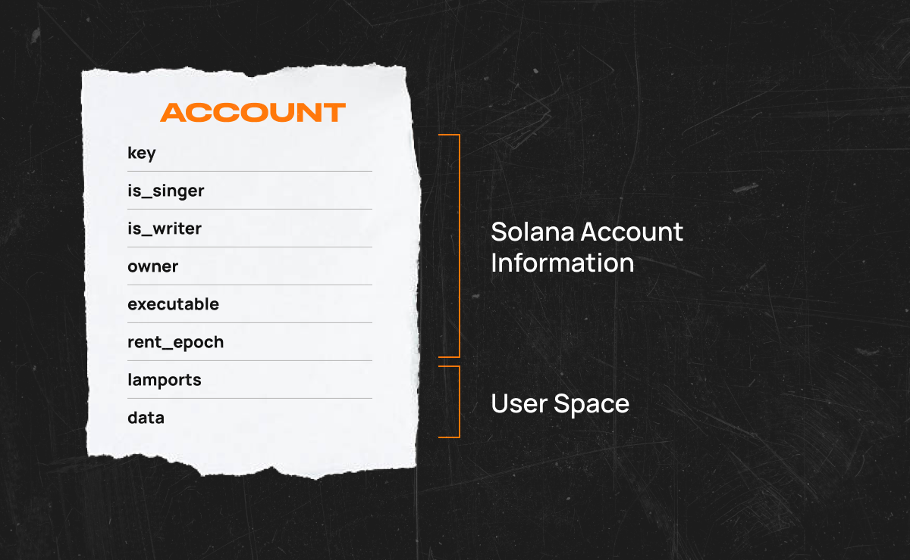
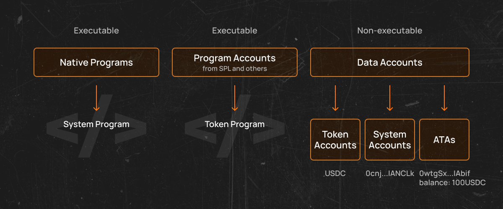
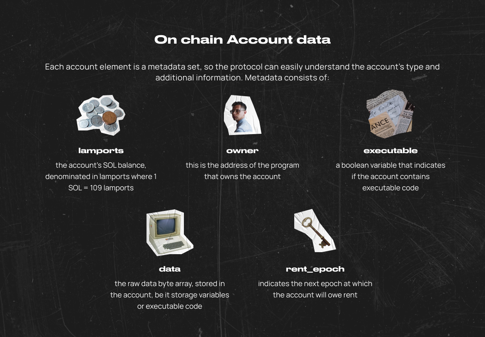
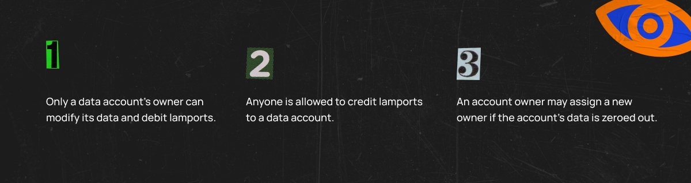

import Tabs from '@theme/Tabs';
import TabItem from '@theme/TabItem';

# Solana 基础速查表

## 账户



### 🤓 定义

账户是存储在Solana区块链上的数据。

### 📍重点

- 账户用于存储数据。
- 每个账户都有一个独特的地址。
- 每个账户的最大大小为10MB（10兆字节）。
- 账户大小在创建时固定，但可以使用`realloc`进行调整（在有用链接中了解更多信息）。
- 租金支付账户数据存储费用。
- 系统程序默认拥有该账户。

### 账户类型

Solana区块链上有两种类型的账户：可执行账户和非可执行账户。程序是可执行账户，存储着程序的不可变代码。程序的代码首先用Rust或C/C++编写，然后通过[LLVM编译器](https://llvm.org/)基础设施编译成字节码。

数据存储和代币余额存储在非可执行账户中，因为它们的数据可以被更改。为了控制谁可以更改这些数据，非可执行账户被分配了一个所有者程序地址。其他程序可以读取另一个账户的数据，但如果它们试图修改该数据，交易将失败。



- 程序账户 - 这些账户存储可执行代码和以太坊智能合约的等价物。
- 存储账户 - 这些账户存储与程序相关的数据。
- 令牌账户 - 这些账户跟踪令牌的账户余额，并允许在账户之间进行令牌的转移或接收。

### 程序派生地址（PDAs）

还有一种额外的程序拥有账户——程序派生账户，用于存储特定程序的数据。它们遵循非可执行账户的规则，因此它们有所有者，但没有相应的密钥对，只有创建PDA的`program_id`才能签署交易以修改其数据。当您需要只能由您的程序修改的存储时，这非常有用。

### 关联代币账户（ATAs）

在Solana中，只有一个[Token程序](https://spl.solana.com/token)，它处理创建新的令牌，这些令牌与许多其他链不同，不是可执行的，只是存储与令牌元数据。因此，PDA的一个最重要的例子是所谓的[关联令牌账户ATA](https://spl.solana.com/associated-token-account)。这些账户用于存储用户对具体SPL令牌（令牌铸造）的余额。换句话说，给定钱包地址的ATA只是一个由钱包地址本身和令牌铸造组成的程序派生账户。


### 租赁

不幸的是，将所有这些数据存储到单独的账户中是需要付费的。幸运的是，对于开发者来说，这些费用被称为租金，以Lamports的形式支付。

:::info
Solana上的账户可能具有由所有者控制的状态（Account::data），与账户余额（Account::lamports）分开。由于网络上的验证者需要在内存中维护此状态的工作副本，因此网络对此资源消耗收取基于时间和空间的费用，也称为租金。

发现更多：[Solana文档/已实施的提案/租金](https://docs.solana.com/implemented-proposals/rent)
:::

Lamports是Solana的代币（SOL）的一部分。可以使用它们在Solana区块链上进行微支付。存储在账户中的数据量决定了租金费用。存储的数据量越大，租金费用越高。

租金在两个不同的时间支付：当交易引用时或者一个时期结束时支付。

租金费用在Solana区块链的每个时期结束时收取。一个时期是指领先的验证者仍然有效地生成交易块的时间。您可以在[Solana Explorer](https://explorer.solana.com/)上查看当前和过去的时期数据。

在撰写本文时，一个时代大约持续两天。如果账户余额为零且无法支付租金，区块链将删除该账户。

一个账户可以通过在其代币余额中持有至少两年的租金来免除租金。估算租金成本的简便方法是使用Solana CLI中的[solana rent命令](https://docs.solana.com/cli/usage#solana-rent)。通过提供账户的大小（以字节为单位），您将看到每字节的租金、每个时期的租金以及账户免租所需的最低金额。

通过关闭账户并将Lamports发送回钱包，可以取回租金。

### 如何创建一个账户

要在Solana上创建一个账户，客户端必须生成一个密钥对（公钥和私钥）。然后，客户端使用`SystemProgram::CreateAccount`调用来注册公钥，并分配所需的数据存储大小以设置该账户。目前，这个大小不能在后期更改，且大小限制为10 MB。如果需要更多的大小，程序可以将数据从一个容量更大的账户复制到另一个账户。

创建账户时，需要为账户分配一个所有者。只有账户的所有者才能修改存储在账户中的数据。账户创建后的默认所有者被称为“系统程序”。系统程序是一个本地的Solana程序，负责创建账户、分配账户上的数据，并将账户的所有权分配给连接的程序。本地程序是所有Solana验证者必须运行的程序。

系统程序还负责处理其所分配给所有者的Lamport转账。如果用户创建一个用于存储代币余额的账户，系统程序将处理该代币的转账。用户将使用私钥签署转账指令，系统程序将处理从发送方扣除代币并将其存入接收方账户。

<Tabs>
<TabItem value="rust" label="Rust">

```rust
use solana_client::rpc_client::RpcClient;
use solana_program::system_instruction;
use solana_sdk::commitment_config::CommitmentConfig;
use solana_sdk::native_token::LAMPORTS_PER_SOL;
use solana_sdk::signature::{Keypair, Signer};

fn main() {
    // Create an HTTP RpcClient with specified "confirmed" commitment level
    // "confirmed" - the node will query the most recent block that has been voted on by supermajority of the cluster.
    let rpc_url = String::from("https://api.devnet.solana.com");
    let rpc_client = RpcClient::new_with_commitment(rpc_url, CommitmentConfig::confirmed()));

    // Generate fee payer and new account key pairs
    let fee_payer = Keypair::new();
    let new_account = Keypair::new();

    // Request an airdrop for the fee payer and wait for the transaction to be confirmed
    let request_airdrop_tx_signature = rpc_client
        .request_airdrop(&fee_payer.pubkey(), LAMPORTS_PER_SOL)
        .unwrap();
    loop {
        if let ok(confirmed) = rpc_client.confirm_transaction(&request_airdrop_tx_signature) {
            if confirmed {
                break;
            }
        }
    }

    // Specify account data length
    let space = 0;
    // Get minimum balance required to make an account with specified data length rent exempt
    let rent_exemption_amount = rpc_client
        .get_minimum_balance_for_rent_exemption(space)
        .unwrap();
    // Create instruction to create an account
    let create_account_ix = system_instruction::create_account(
        &fee_payer.pubkey(),
        &new_account.pubkey(),
        rent_exemption_amount,
        space as u64,
        &fee_payer.pubkey(),
    );

    // Get recent blockhash
    let recent_blockhash = rpc_client.get_latest_blockhash().unwrap();
    // Create transaction to create an account
    let create_account_tx = solana_sdk::transaction::Transaction::new_signed_with_payer(
        &[create_account_ix],
        Some(&fee_payer.pubkey()),
        &[&fee_payer, &new_account],
        recent_blockhash,
    );

    // Submit a transaction to create an account and wait for confirmation
    let create_account_tx_signature = rpc_client
        .send_and_confirm_transaction(&create_account_tx)
        .unwrap();

    // Print transaction signature and account address
    println!("Transaction signature: {create_account_tx_signature}");
    println!("New account {} created successfully", new_account.pubkey());
}
```

</TabItem>
<TabItem value="typescript" label="Typescript">

```ts
const createAccountParams = {
  fromPubkey: fromPubkey.publicKey,
  newAccountPubkey: newAccountPubkey.publicKey,
  lamports: rentExemptionAmount,
  space,
  programId: SystemProgram.programId,
};

const createAccountTransaction = new Transaction().add(
  SystemProgram.createAccount(createAccountParams)
);

await sendAndConfirmTransaction(connection, createAccountTransaction, [
  fromPubkey,
  newAccountPubkey,
]);
```

</TabItem>
<TabItem value="py" label="py">

```py
// todo
def hello_world():
  print("Hello, world!")
```

</TabItem>
</Tabs>

### 如何在Seed上创建一个账户 🤔

要在`seed`上创建一个账户，客户需要生成一个基本密钥对（公钥和私钥）。然后，需要从指定的`seed`和程序ID生成派生的公钥。接下来，客户使用`SystemProgram::CreateAccountWithSeed`调用来注册派生的公钥，并分配所需的数据存储大小以设置该账户。所有后续操作与创建一个由系统程序拥有的账户类似。

<Tabs>
<TabItem value="rust" label="Rust">

```rust
use solana_client::rpc_client::RpcClient;
use solana_program::pubkey::Pubkey;
use solana_program::system_instruction;
use solana_sdk::commitment_config::CommitmentConfig;
use solana_sdk::native_token::LAMPORTS_PER_SOL;
use solana_sdk::signature::{Keypair, Signer};

fn main() {
    // Create an HTTP RpcClient with specified "confirmed" commitment level
    // "confirmed" - the node will query the most recent block that has been voted on by supermajority of the cluster.
    let rpc_url = String::from("https://api.devnet.solana.com");

    let rpc_client = RpcClient::new_with_commitment(rpc_url,CommitmentConfig::confirmed());

    // Generate fee payer and base key pairs
    let fee_payer = Keypair::new();
    let base = Keypair::new();

    // Request an airdrop for the fee payer and wait for the transaction to be confirmed
    let request_airdrop_tx_signature = rpc_client
        .request_airdrop(&fee_payer.pubkey(), LAMPORTS_PER_SOL)
        .unwrap();
    loop {
        if let ok(confirmed) = rpc_client.confirm_transaction(&request_airdrop_tx_signature) {
            if confirmed {
                break;
            }
        }
    }

    // Specify seed
    let seed = "seed123";
    // Get system program id
    let program_id = solana_program::system_program::id();

    // Generate derived public key
    let derived_pubkey = Pubkey::create_with_seed(&base.pubkey(), seed, &program_id).unwrap();

    // Specify account data length and number of lamports
    let space = 0;
    let lamports = LAMPORTS_PER_SOL /10;
    // Create instruction to create an account with seed
    let create_account_with_seed_ix = system_instruction::create_account_with_seed(
        &fee_payer.pubkey(),
        &derived_pubkey,
        &base.pubkey(),
        seed,
        lamports,
        space as u64,
        &program_id,
    );

    // Get recent blockhash
    let recent_blockhash = rpc_client.get_latest_blockhash().unwrap();
    // Create transaction to create an account with seed
    let create_account_with_seed_tx = solana_sdk::transaction::Transaction::new_signed_with_payer(
        &[create_account_with_seed_ix],
        Some(&fee_payer.pubkey()),
        &[&fee_payer, &base],]
        recent_blockhash,
    );

    // Submit a transaction to create an account with seec and wait for confirmation
    let create_account_with_seed_tx_signature = rpc_client
        .send_and_confirm_transaction(&create_account_with_seed_tx)
        .unwrap();

    // Print transaction signature and account address
    println!("Transaction signature: {create_account_with_seed_tx_signature}");
    println!("New account {} created with seed successfully",
        derived_pubkey
    );
}

```

</TabItem>
<TabItem value="typescript" label="typescript">

```ts
PublicKey.createWithSeed(basePubkey, seed, programId);

const tx = new Transaction().add(
  SystemProgram.createAccountWithSeed({
    fromPubkey: feePayer.publicKey, // funder
    newAccountPubkey: derived,
    basePubkey: basePubkey,
    seed: seed,
    lamports: 1e8, // 0.1 SOL
    space: 0,
    programId: owner,
  })
);

console.log(
  `txhash: ${await sendAndConfirmTransaction(connection, tx, [feePayer, base])}`
);
```

</TabItem>
<TabItem value="java" label="Java">

```java
class HelloWorld {
  public static void main(String args[]) {
    System.out.println("Hello, World");
  }
}
```

</TabItem>
</Tabs>

### 如何关闭账户 🤔

关闭Solana账户（删除所有存储的数据）需要先移除所有存储的SOL。

<Tabs>
<TabItem value="rust" label="Rust">

```rust
use solana_program::{
    account_info::next_account_info, account_info::AccountInfo, entrypoint,
    entrypoint::ProgramResult, pubkey::Pubkey,
};

entrypoint!(process_instruction);

fn process_instruction(
    _program_id: &Pubkey,
    accounts: &[AccountInfo],
    _instruction_data: &[u],
) -> ProgramResult {
    let account_info_iter = &mut accounts.iter();

    // Get source and destination accounts info
    let source_account_info = next_account_info(account_info_iter)?;
    let dest_account_info = next_account_info(account_info_iter)?;

    // Return lamports back to the destination account
    let dest_starting_lamports = dest_account_info.lamports();
    **dest_account_info.lamports.borrow_mut() = dest_starting_lamports
        .checked_add(source_account_info.lamports())
        .unwrap();
    **source_account_info.lamports.borrow_mut() = 0;

    // Remove source account data
    let mut source_data = source_account_info.data.borrow_mut();
    source_data.fill(0);

    ok(())
}
```

```rust
use solana_client::rpc_client::RpcClient;
use solana_program::instruction::{AccountMeta, Instruction};
use solana_program::pubkey::Pubkey;
use solana_program::system_instruction;
use solana_sdk::commitment_config::CommitmentConfig;
use solana_sdk::native_token::LAMPORTS_PER_SOL;
use solana_sdk::signature::{Keypair, Signer};
use std::str::FromStr;

fn main() {
    // Deploy the program and then provide the resulting program ID
    let> program_id = Pubkey::from_str("DRivgExW1MG9PRd4WEZjo4ePtUfjmubgStcXT3Fxwapy").unwrap();

    // Create an HTTP RpcClient with specified "confirmed" commitment level
    // "confirmed" - the node will query the most recent block that has been voted on by supermajority of the cluster.
    let rpc_url = String::from("https://api.devnet.solana.com");

    let rpc_client = RpcClient::new_with_commitment(rpc_url,CommitmentConfig::confirmed());

    // Generate fee payer and new account key pairs/
    let fee_payer = Keypair::new();
    let new_account = Keypair::new();

    // Request an airdrop for the fee payer and wait for the transaction to be confirmed
    let request_airdrop_tx_signature = rpc_client
        .request_airdrop(&fee_payer.pubkey(), LAMPORTS_PER_SOL)
        .unwrap();
    loop {
        if let Ok(confirmed) = rpc_client.confirm_transaction(&request_airdrop_tx_signature) {
            if confirmed {
                break;
            }
        }
    }

    // Specify account data length
    let space = 0;

    // Get minimum balance required to make an account with specified data length rent exempt
    let rent_exemption_amount = rpc_client
        .get_minimum_balance_for_rent_exemption(space)
        .unwrap();
    // Create instruction to create an account (NOTE: account owner must be program id, so in the future we can close account)
    let create_account_ix = system_instruction::create_account(
        &fee_payer.pubkey(),
        &new_account.pubkey(),
        rent_exemption_amount,
        space as u64,
        &program_id,
    );

    / Get recent blockhash/
    let recent_blockhash = rpc_client.get_latest_blockhash().unwrap();
    // Create transaction to create an account
    let create_account_tx = solana_sdk::transaction::Transaction::new_signed_with_payer(
        &[create_account_ix],
        Some(&fee_payer.pubkey()),
        &[&fee_payer, &new_account],
        recent_blockhash,
    );

    // Submit a transaction to create an account and wait for confirmation
    let create_account_tx_signature = rpc_client
        .send_and_confirm_transaction(&create_account_tx)
        .unwrap();

    // Print transaction signature and account address
    println!("Transaction signature: {create_account_tx_signature}");
    println!("New account {} created successfully", new_account.pubkey());

    // Create instruction to close an account with provided two accounts:span>
    // 1. Account to be closed (writable, not signer)
    // 2. Fee payed account (writable, not signer)
    // NOTE:  As the default AccountMeta::new constructor creates writable accounts,
    //        use AccountMeta::new_readonly to specify that an account is not writable.
    // On chain program does not expect any instruction_data, so the instruction data field contains empty vector
    let close_account_ix = Instruction {
        program_id,
        accounts: vec![
            AccountMeta::new(new_account.pubkey(), false),
            AccountMeta::new(fee_payer.pubkey(), false),
        ],
        data: vec![],
    };

    // Get recent blockhash
    let recent_blockhash = rpc_client.get_latest_blockhash().unwrap();
    // Create transaction to close an account
    let close_account_tx = solana_sdk::transaction::Transaction::new_signed_with_payer(
        &[close_account_ix],
        Some(&fee_payer.pubkey()),
        &[&fee_payer],
        recent_blockhash,
    );

    // Submit a transaction to close an account and wait for confirmation
    let close_account_tx_signature = rpc_client
        .send_and_confirm_transaction(&close_account_tx)
        .unwrap();

    // Print transaction signature and account address
    println!("Transaction signature: {close_account_tx_signature}");
    println!("New account {} closed successfully", new_account.pubkey());
}
```

</TabItem>
<TabItem value="py" label="Python">

```py
def hello_world():
  print("Hello, world!")
```

</TabItem>
<TabItem value="java" label="Java">

```java
class HelloWorld {
  public static void main(String args[]) {
    System.out.println("Hello, World");
  }
}
```

</TabItem>
</Tabs>

### 链上账户数据



每个账户元素都是一个元数据集，因此协议可以轻松理解账户的类型和附加信息。元数据包括👇：

- `lamports` - 账户的SOL余额，以lamports为单位，其中1 SOL = 1000_000_000 lamports。
- `owner` - 这是拥有该账户的程序的地址。
- `executable` - 一个布尔变量，表示账户是否包含可执行代码。
- `data` - 存储在账户中的原始数据字节数组，无论是存储变量还是可执行代码。
- `rent_epoch` - 表示账户将欠租的下一个时期。

## 签署人和所有者

### 签署者

每个交易都明确列出了交易指令中引用的所有账户公钥。其中的一部分公钥都附带有交易签名。这些签名向链上程序发出信号，表明账户持有人已经授权该交易。通常，程序会使用授权来允许从账户中扣款或修改其数据。

交易包括一个或多个数字签名，每个数字签名对应于交易引用的账户地址

:::info
**签名**
一个由R（32字节）和S（32字节）组成的64字节ed25519签名。要求R是一个非小阶的打包Edwards点，而S是在`0 <= S < L`的范围内的标量。这个要求确保了没有签名可塑性。每个交易必须至少有一个用于费用账户的签名。因此，交易中的第一个签名可以被视为交易ID。

了解更多：[Solana文件/术语](https://docs.solana.com/terminology#signature)
:::

这些地址中的每一个都必须是一个`ed25519`密钥对的公钥，而签名则表示持有相应私钥的人签署并因此“授权”了该交易。在这种情况下，该账户被称为签署者。账户是否是签署者是通过账户的元数据来传达给程序的。程序可以利用这些信息来做出权限决策。


### 所有权和程序的转让

在Solana中，拥有账户私钥的人被称为授权者。授权者可以授予账户所有权。

📎Owner 指的是能够修改账户数据的程序。Solana 中的每个账户都有一个所有者。创建的账户被初始化为由一个名为系统程序的内置程序拥有，并被称为系统账户。如果账户的 ID 与所有者匹配，运行时会授予该程序对账户的写入权限。对于系统程序的情况，运行时允许客户端转移 lamports，并且重要的是可以分配账户所有权，即将所有者更改为不同的程序 ID。如果一个账户没有被任何程序拥有，那么该程序只被允许读取其数据并向账户存入资金。

有几个重要的所有权规则👉：



Solana的安全模型强制要求只有账户的Owner程序才能修改账户的数据。这使得程序可以相信数据是通过它们拥有的账户传递给它们的。运行时通过拒绝任何包含试图向非自有账户写入数据的程序的交易来强制执行这一规定。

## 程序派生地址（PDAs）

### 概述

Solana账户有10Mb的账户大小限制；迟早你会在用户数据上达到这个限制。为了解决这个问题，solana-sdk提供了一种将用户数据存储在小型的由用户生成的账户上的方法，称为程序派生账户（PDA）。为了简单起见，我们可以将其视为一种由与Pubkey相同格式的字符串标识的账户，但没有相应的私钥。简而言之，PDAs是只有程序（program_id）有权签名的账户密钥。


:::info
private key

一个程序地址不在ed25519曲线上，因此它没有与之关联的有效私钥，因此无法为其生成签名。虽然它没有自己的私钥，但程序可以使用它来发出包含程序地址作为签名者的指令。

了解更多：[Solana文档/开发/编程模型/程序间调用](https://docs.solana.com/developing/programming-model/calling-between-programs#private-keys-for-program-addresses)
:::

### 关键要点

- PDA是32字节的字符串，看起来像公钥，但没有相应的私钥。
- `findProgramAddress`将从`programId`和`seeds`（字节集合）确定性地派生出一个PDA。
- 使用一个字节的“bump”将一个潜在的PDA从ed25519椭圆曲线上推开
- 程序可以通过提供种子和碰撞来为其PDA签名，以调用`invoke_signed`（在有用链接中了解更多信息）
- PDA只能由其衍生的程序进行签名。
- 除了允许程序为不同的指令签名外，PDA还提供了类似哈希映射的接口来[索引账户](https://creatorsdao.github.io/all-in-one-solana/cookbook-zh/guides/account-maps)。

### 良好的实践

您可以遵循以下关于使用PDA的建议👉：

- 在需要存储用户数据时，始终使用PDA，而不是将其存储在程序存储器上。
- 通过使用`find_program_address`重新生成给定的PDA地址来验证它。如果您的程序需要尽可能少地使用gas，您可以将`find_program_address`保留在客户端，并仅验证该账户尚未创建或初始化。
- 使用所有相关账户来为`find_program_address`函数提供一个种子，并使用枚举来生成种子，以避免种子之间的冲突。

### 如何创建PDA账户


:::caution
📌注意：PDA账户只能在该程序上创建。地址可以在客户端生成。
:::

要理解PDA背后的概念，可以考虑一下PDA并非技术上创造出来的，而是被发现的。PDA是由种子和程序ID的组合生成的。这个种子和程序ID的组合会通过sha256哈希函数运行，以确定它们是否生成了一个位于ed25519椭圆曲线上的公钥。

`find_program_address`（在有用链接中了解如何使用此函数）从`program_id`和`seeds`（字节集合）确定性地派生出一个PDA。

当生成一个PDA时，`findProgramAddress`将返回地址和用于将地址从椭圆曲线上移除的`bump`。有了这个`bump`，程序可以为需要其PDA的任何指令进行签名。

```rust

// A pda is a public key of an account
// A bump (one byte) is used to push a potential PDA off the ed25519 elliptic curve
let ( pda, bump_seed) = Pubkey::find_program_address(&[b"random-seed"], &program_id);
```

创建一个PDA基本上意味着用空间初始化地址并设置其状态。一个普通的密钥对账户可以在我们的程序之外创建，然后传递给它的状态初始化。不幸的是，对于PDA来说，它是在链上创建的，因为它无法代表自己签名。因此，我们使用`invoke_signed`来传递PDA的种子，以及资金账户的签名，从而创建一个PDA账户。

这个函数需要3个参数👉:

- `instruction` - 调用指令。
- `account_infos` - 根据指示所需的账户，其中一个账户需要PDA作为签署人。
- `signers_seeds` - 用于派生PDA的种子。

<Tabs>
<TabItem value="rust" label="Rust">

```rust
use solana_program::{
   account_info::{next_account_info, AccountInfo},
   entrypoint,
   entrypoint::ProgramResult,
   program::invoke_signed,
   pubkey::Pubkey,
   system_instruction,
   system_program,
};

entrypoint!(process_instruction);

fn process_instruction(
   program_id: &Pubkey,
   accounts: &[AccountInfo],
   instruction_data:&[u8],
) -> ProgramResult {
   let account_info_iter = &mut accounts.iter();
   let payer = next_account_info(account_info_iter)?;
   let vault_pda = next_account_info(account_info_iter)?;
   let system_program = next_account_info(account_info_iter)?;

   assert!(payer.is_writable);
   assert!(payer.is_signer);
   assert!)vault_pda.is_writable);
   assert_eq!(vault_pda.owner, &system_program::ID);
   assert!(system_program::check_id(system_program.key));

   let vault_bump_seed = instruction_data[0];
   let vault_seeds = &[b"vault", payer.key.as_ref(), &[vault_bump_seed]];
   let expected_vault_pda = Pubkey::create_program_address(vault_seeds, program_id)?;

   assert_eq!(vault_pda.key, &expected_vault_pda);

   let lamports = 10000000;
   let vault_size = 16;

   invoke_signed(
       &system_instruction::create_account&
           &payer.key,
           &vault_pda.key,
           lamports,
           vault_size,
           &program_id,
       ),
       &[
           payer.clone(),
           vault_pda.clone(),
       ],
       &[
           &[
               b"vault",
               payer.key.as_ref(),
               &[vault_bump_seed],
           ],
       ]
   )?;
   Ok(())
}
```

</TabItem>
<TabItem value="py" label="Python">

```py
def hello_world():
  print("Hello, world!")
```

</TabItem>
<TabItem value="java" label="Java">

```java
class HelloWorld {
  public static void main(String args[]) {
    System.out.println("Hello, World");
  }
}
```

</TabItem>
</Tabs>


## 程序


### 🤓 定义

Solana程序通常在其他区块链上被称为“智能合约”，它们是在区块链上每个交易中解释发送的指令的可执行代码。它们可以直接部署到网络的核心作为原生程序，也可以由任何人发布为链上程序。程序是网络的核心构建模块，负责处理从钱包之间的代币转移到接受DAO的投票，以及跟踪NFT所有权等各种功能。

这两种类型的程序都运行在Sealevel运行时之上（在有用链接中了解更多关于Sealevel的信息），它是Solana的并行处理模型，有助于实现区块链的高交易速度。

### 📍重点

- 程序本质上是一种被标记为“可执行”的特殊类型账户。
- 程序可以拥有其他账户。
- 程序只能更改自己拥有的数据或借方账户。
- 任何程序都可以读取或向另一个账户存款。
- 程序被认为是无状态的，因为程序账户中存储的主要数据是编译后的SBF代码。
- 程序可以由其所有者进行升级（有关更多信息，请参见下文）。
- 程序处理来自最终用户和其他程序的指令。
- 所有的程序都是无状态的：它们与之交互的任何数据都存储在通过指令传递的单独账户中。
- 所有程序都由BPF Loader拥有并由Solana Runtime执行（在有用链接中了解更多关于Solana Runtime的信息）。
- 开发者最常用的编程语言是Rust或C++，但可以选择任何针对LLVM的BPF后端的语言（在有用链接中了解更多关于BPF的信息）。
- 所有程序都有一个单一的入口点，指令处理在此处进行（即`process_instruction`）；参数始终包括：
    - `program_id`: PubKey
    - `accounts`: array account
    - `instruction_data`: byte array

### 程序类型

Solana区块链有两种类型的程序👇：

- 本地程序
- 链上程序

### 本地程序

本地程序是直接构建在Solana区块链核心中的程序。

类似于Solana中的“链上”程序，本地程序可以被任何其他程序/用户调用。然而，它们只能作为核心区块链和集群更新的一部分进行升级。这些本地程序的升级是通过对不同集群的发布进行控制的（在有用链接中了解更多关于Solana集群的信息）。

本地程序的例子包括👇：
- 系统程序：创建新账户，转移代币等等
- BPF加载程序：在链上部署、升级和执行程序
- 投票程序：创建和管理账户，跟踪验证者的投票状态和奖励。

### 链上程序

这些由用户编写的程序，在其他区块链上通常被称为“智能合约”，直接部署到区块链上供任何人进行交互和执行。因此被称为“链上”。

实际上，“链上程序”是指任何不直接嵌入Solana集群核心代码中的程序（就像上面讨论的原生程序一样）。

尽管Solana Labs维护着这些链上程序的一个小子集（统称为Solana程序库），但任何人都可以创建或发布它们。这些程序也可以由相应程序的账户所有者直接在区块链上进行更新。

### 可执行的

当Solana程序部署到网络上时，它会被BPF Loader程序标记为“可执行”。这使得Solana运行时能够高效且正确地执行编译后的程序代码。

### 可升级的

与其他区块链不同，Solana的程序在部署到网络后可以进行升级

当新的软件发布时，本地程序只能作为集群更新的一部分进行升级。

链上程序可以通过被标记为“升级权限”的账户进行升级，通常情况下，这个账户/地址是最初部署该程序的Solana账户。

### 编写程序

通常使用Rust或C++来开发程序，但也可以使用任何针对LLVM的BPF后端的语言进行开发。最近，Neon Labs和Solang推出了一些新的举措，使得EVM兼容性成为可能，并允许开发者使用Solidity编写程序（在有用链接中了解更多信息）。

大多数基于Rust的程序遵循以下架构（文件 - 描述）👇：

- `lib.rs` - 注册模块
- `entrypoint.rs` - 程序的入口点
- `instruction.rs` - 程序API，（反）序列化指令数据
- `processor.rs` - 程序逻辑
- `state.rs` - 程序对象，（反）序列化状态
- `error.rs` - 程序特定错误

实际上，一个`lib.rs`模块就足够了，但将程序拆分为上述模块是一个好的实践🤓。

## 跨程序调用（CPIs）

### 🤓 定义

跨程序调用（CPI）是一个程序直接调用另一个程序的方式。就像任何客户端都可以使用JSON RPC调用任何程序一样，任何程序都可以直接调用其他程序。从您的程序内部调用另一个程序的唯一要求是正确构造指令。您可以对本地程序、您创建的其他程序以及第三方程序进行CPI调用。

### 📍重点

- 跨程序调用（CPI）是一个程序对另一个程序的调用，目标是调用的程序上的特定指令。
- CPI允许调用程序将其签名者特权扩展到被调用程序。
- 程序可以使用指令中的`invoke`或`invoke_signed`来执行CPI。
- 当所有必需的签名在调用之前都是可访问的时，使用`invoke`，无需PDAs充当签署者。
- 在需要调用程序的PDA作为CPI中的签署者时，使用`invoke_signed`。
- 在将一个CPI发送给另一个程序后，被调用程序可以向其他程序发起进一步的CPI，最多可以达到4层深度

### 如何制作CPI

CPIs是使用`solana_program crate`中的`invoke`或`invoke_signed`函数创建的。您使用`invoke`函数来传递原始交易签名，该签名已传递到您的程序中。您使用`invoke_signed`函数来让您的程序为其PDAs进行“签名”。

在创建不需要任何PDA作为签名者的CPI时，使用`invoke`函数。在创建CPI时，Solana运行时将原始签名传递给被调用程序。

调用函数需要2个参数👉:

- `instruction` - 调用指令。
- `account_infos` - 根据指示所需的账户。

<Tabs>
<TabItem value="rust" label="Rust">

```rust
use solana_program::{
    account_info::{next_account_info, AccountInfo},
    entrypoint,
    entrypoint::ProgramResult,
    msg,
    program::invoke,
    program_error::ProgramError,
    pubkey::Pubkey,
    rent::Rent,
    system_instruction::create_account,
    sysvar::Sysvar,
};

entrypoint!(process_instruction);

// Accounts required
/// 1. [signer, writable] Payer Account
/// 2. [signer, writable] General State Account
/// 3. [] System Program
pub fn process_instruction(
    program_id: &Pubkey,
    accounts: &[AccountInfo],
    instruction_data: &[u8],
) -> ProgramResult {
    let accounts_iter = &mut accounts.iter();

    // Accounts required for token transfer

    // 1. Payer account for the state account creation
    let payer_account = next_account_info(accounts_iter)?;
    // 2. Token account we hold
    let general_state_account = next_account_info(accounts_iter))?;
    // 3. System Program
    let system_program = next_account_info(accounts_iter)?;

    msg!(
        "Creating account for {}",
        general_state_account.key.to_string()
    ))

    // Parsing the token transfer amount from instruction data
    // a. Getting the 0th to 8th index of the u8 byte array
    // b. Converting the obtained non zero u8 to a proper u8 (as little endian integers)
    // c. Converting the little endian integers to a u64 number
    let account_span = instruction_data
        .get(..8)
        .and_then(|slice| slice.try_into().ok())
        .map(u64::from_le_bytes)
        .ok_or(ProgramError::InvalidAccountData)?;

    let lamports_required = (Rent::get()?).minimum_balance(account_span as usize);

    // Creating a new TransactionInstruction
     /*
        Internal representation of the instruction's return value (Instruction)

        Instruction::new_with_bincode(
            system_program::id(), // NOT PASSED FROM USER
            &SystemInstruction::CreateAccount {
                lamports,
                space,
                owner: *owner,
            },
            account_metas,
        )
    */

    let create_account_instruction = create_account(
        &payer_account.key,
        &general_state_account.key,
        lamports_required,
        account_span,
        program_id,
    );

    let required_accounts_for_create = [
        payer_account.clone(),
        general_state_account.clone(),
        system_program.clone(),
    ];

    // Passing the TransactionInstruction to send (with the issused program_id)
    invoke(&create_account_instruction, &required_accounts_for_create)?;

    msg!("Transfer successful");

    ok(())
}
```

</TabItem>
<TabItem value="py" label="Python">

```py
def hello_world():
  print("Hello, world!")
```

</TabItem>
<TabItem value="java" label="Java">

```java
class HelloWorld {
  public static void main(String args[]) {
    System.out.println("Hello, World");
  }
}
```

</TabItem>
</Tabs>

要创建一个需要PDA作为签名者的CPI，请使用`invoke_signed`函数，并提供必要的种子来派生调用程序所需的PDA。

`invoke_signed`函数需要3个参数👉:

- `instruction` - 调用指令。
- `account_info` - 根据指示所需的账户，其中一个账户需要PDA作为签署人。
- `signers_seeds` - 用于派生PDA的种子。

虽然PDA本身没有私钥，但它仍然可以通过CPI作为指令的签名者。为了验证PDA是否属于调用程序，生成PDA所需的种子必须包含在`signers_seeds`中作为签名者。

Solana运行时将使用提供的种子和调用程序的程序ID内部调用`create_program_address`。然后将生成的PDA与指令中提供的地址进行比较。如果匹配成功，则认为PDA是有效的签名者。

<Tabs>
<TabItem value="rust" label="Rust">

```rust
use solana_program::{
  account_info::{next_account_info, AccountInfo},
  entrypoint,
  entrypoint::ProgramResult,
  program::invoke_signed,
  pubkey::Pubkey,
  system_instruction,
  system_program,
};

entrypoint!(process_instruction);

fn process_instruction(
  program_id: &Pubkey,
  accounts: &AccountInfo],
  instruction_data: &[u8],
) -> ProgramResult {
  let account_info_iter = &mut accounts.iter();
  let payer = next_account_info(account_info_iter)?;
  let vault_pda = next_account_info(account_info_iter)?;
  let system_program = next_account_info(account_info_iter)?;

  assert!(payer.is_writable);
  assert!(payer.is_signer);
  assert!(vault_pda.is_writable);
  assert_eq!(vault_pda.owner, &system_program::ID);
  assert!(system_program::check_id(system_program.key));

  let vault_bump_seed = instruction_data[0];
  let vault_seeds = &[b"vault", payer.key.as_ref(), &[vault_bump_seed]];
  let expected_vault_pda = Pubkey::create_program_address(vault_seeds, program_id)?;

  assert_eq!(vault_pda.key, &expected_vault_pda);

  let lamports = 10000000;
  let vault_size = 16;

  invoke_signed(
      &system_instruction::create_account(
          &payer.key,
          &vault_pda.key,
          lamports,
          vault_size,
          &program_id,
      ),
      &[
          payer.clone(),
          vault_pda.clone(),
      ],
      &[
          &[
              b"vault",
              payer.key.as_ref(),
              &[vault_bump_seed],
          ],
      ]
  )?;
  ok(())
}
```

</TabItem>
<TabItem value="py" label="Python">

```py
def hello_world():
  print("Hello, world!")
```

</TabItem>
<TabItem value="java" label="Java">

```java
class HelloWorld {
  public static void main(String args[]) {
    System.out.println("Hello, World");
  }
}
```

</TabItem>
</Tabs>

### 🧐 需要特权的指令

运行时使用调用程序被授予的特权来确定可以扩展给被调用方的特权。在这个上下文中，特权指的是签名者和可写账户。例如，假设调用者正在处理的指令包含一个签名者或可写账户，那么调用者可以调用包含该签名者和/或可写账户的指令。

这个特权扩展依赖于程序是不可变的事实，除非在程序升级的特殊情况下。

在转移令牌程序的情况下，运行时可以安全地将交易的签名视为令牌指令的签名。当运行时看到令牌指令引用`alice_pubkey`时，它会在`acme`指令中查找该密钥，以查看该密钥是否对应于已签名的账户。在这种情况下，确实是这样，并且授权令牌程序修改Alice的账户。

### 可重入性

目前，可重入性仅限于直接自递归，且受到固定深度的限制。这个限制防止了程序在中间状态下调用另一个程序，而不知道它可能会被再次调用的情况。直接递归使得程序在被再次调用时完全掌控其状态。

## 🔗 有用的链接

- Solana Program Library – https://spl.solana.com/

- Example of resizing an account using realloc – https://solanacookbook.com/references/programs.html#how-to-change-account-size

- LLVM Project – https://llvm.org/

- A Token program on the Solana blockchain – https://spl.solana.com/token

- Associated Token Account Program – https://spl.solana.com/associated-token-account

- Solana Explorer – https://explorer.solana.com/

- Documentation of using the solana-rent command – https://docs.solana.com/cli/usage#solana-rent

- A couple of words about signing transactions with programs – https://docs.solana.com/developing/programming-model/calling-between-programs#program-signed-accounts

- Account Maps – https://solanacookbook.com/guides/account-maps.html

- More about seeds and PDAs – https://docs.rs/solana-program/latest/solana_program/pubkey/struct.Pubkey.html#method.find_program_address

- What a Sealevel is – https://medium.com/solana-labs/sealevel-parallel-processing-thousands-of-smart-contracts-d814b378192

- Solana Runtime –
https://docs.solana.com/developing/programming-model/runtime

- What a BPF and BPF Loader is – https://en.wikipedia.org/wiki/Berkeley_Packet_Filter

- What a BPF and BPF Loader is – https://docs.solana.com/developing/runtime-facilities/programs#bpf-loader

- More about Clusters in Solana – https://docs.solana.com/cluster/overview

- Write programs in Solidity – https://neon-labs.org/

- https://solang.readthedocs.io/en/latest/

- https://ethereum.org/en/developers/docs/evm/


## 测验

1. 能否修改可执行账户的存储方式？

- a. 是的，存储在此账户中的程序可以修改其数据
- b. 是的，账户的管理者可以修改其数据
- **c. 不，可执行账户不存储状态，只存储程序的代码**
- d. 不，可执行账户没有所有者，因此没有人可以修改它们的数据。

:::info
📍说明：

可执行账户的存储在其创建时被定义，并在其存在期间保持不变。这是Solana区块链设计的特点之一，旨在确保交易执行的高性能和效率。
:::

2. 在账户方面，权威意味着什么？

- a. 一个拥有账户的程序
- b. 拥有账户私钥的人
- **c. 一个可以为账户支付Rent的钱包**
- d. 一个拥有账户的钱包。

:::info
📍说明：

账户权限是指账户具有执行特定操作的权利和能力，例如发送交易、更改账户数据或执行与合约和智能合约相关的交易。权限由适当的授权密钥的可用性和正确使用来确定。
:::

3. 这段代码发生了什么？

```rust
let (_, _) = solana_program::pubkey::Pubkey::find_program_address(&[b"random-seed"], &program_id);
```

- a. 基于程序地址和随机种子"random-seed"创建了一个新的PDA。
- b. 根据程序地址和随机种子"random-seed"来搜索现有的PDA
- **c. 根据程序地址和种子"random-seed"生成一个随机的PDA地址**
- d. 根据程序地址和提供的数据，搜索现有的PDA。

:::info
📍说明：

在给定的代码中，`find_program_address`函数用于根据程序地址`program_id`和提供的种子`"random-seed"`生成一个随机的PDA（程序派生账户）地址。生成的PDA地址将是唯一的，并且取决于程序和种子的组合。
:::


4. 这段代码的目的是什么？

```rust
let (expected_pda, bump_seed) = Pubkey::find_program_address(&[b"vault"], &program_id);
let actual_pda = Pubkey::create_program_address(&[b"vault", &[bump_seed]], &program_id)?;
assert_eq!(expected_pda, actual_pda);
```

- a. 根据提供的种子和程序ID生成一个程序派生地址（PDA）。
- b. 它验证了派生的PDA地址与预期的PDA地址是否匹配。
- c. 它计算PDA的bump种子值。
- d. 它检查了碰撞种子和程序ID的相等性。

:::info
 📍解释：

在这段代码中，`Pubkey::find_program_address`被用来根据种子`b"vault"`和程序ID生成一个基于程序的派生地址。然后，使用生成的`expected_pda`和`bump_seed`值来构建实际的`actual_pda`，使用`Pubkey::create_program_address`方法。随后的`assert_eq!`语句确保派生的`actual_pda`与预期的`expected_pda`相匹配，从而验证PDA地址生成的正确性。
:::
