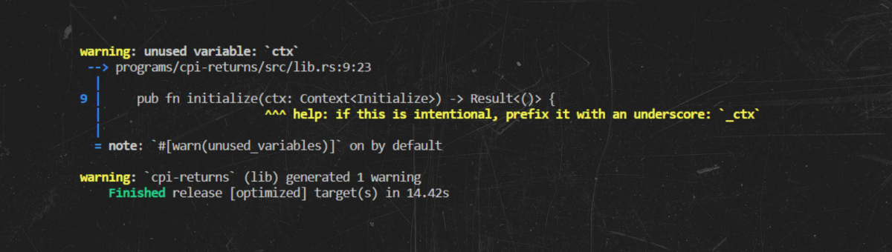
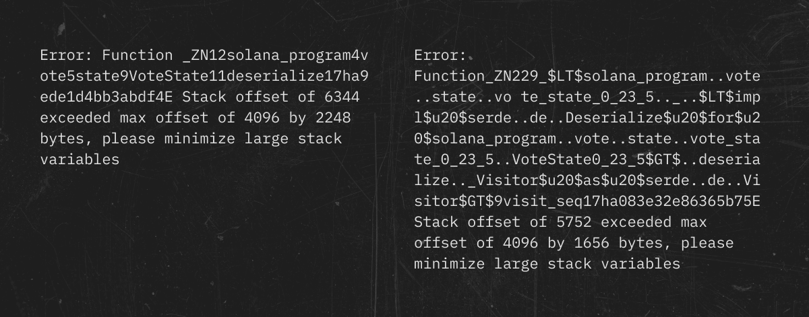
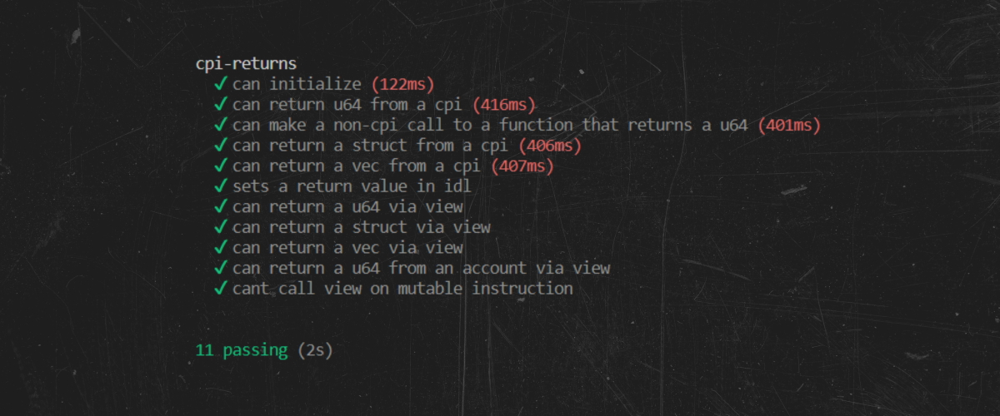

# Solana与Anchor的开发

## 概述

Anchor是一个Rust框架，用于在Solana区块链上创建dApps。在Solana上开发的一个特点是需要使用大量的模板代码，这可能是一个耗时且昂贵的过程。Anchor通过提供各种工具（如账户和指令数据的(反)序列化）来简化这个过程，减少开发时间。

## 优点和缺点

就像世界上的一切一样，Anchor有好的和坏的使用情况。以下是一个简要的检查清单，告诉你何时应该选择Anchor而不是纯solana-sdk👉：

- 这个项目将不仅仅是一个合同和一个页面的申请。
- 该项目将拥有复杂的账户管理。
- 该项目在链上存储了许多不同的模型，并且拥有复杂的WebUI与其进行交互。
- 该项目将与使用Anchor编写的程序进行交互。

另一方面，在以下情况下，您可能更喜欢纯Solana-SDK而不是Anchor框架👇。

- 简单的小型项目，具有简单的Web用户界面。
- 该项目需要对传递的数据进行精确控制，包括存储方式和调用的BPF指令。
- 项目的安全问题非常重要。
- 与您的项目的交互仅限于基于Rust的软件，因此您不需要接口描述语言（以下简称IDL）。

根据您的情况选择适当的工具集。

## 安装

我们不提供安装说明，因为它们可能会发生变化。在继续下一步之前，请参考官方文档https://www.anchor-lang.com/docs/installation 中的说明。

:::caution
🚨警告，在编写本课程时，v1.15.x版本存在一些问题。我们希望这些问题能够尽快解决。然而，如果问题仍然存在，我们建议使用当前的v.1.14.x版本。
:::

## 主要编程支柱

在本教程中，我们将介绍四个关键的宏，它们极大地简化了开发过程，并使Anchor变得如此吸引人。

让我们以Anchor框架开发者的一个测试案例来考虑它们，即一个简单的去中心化应用程序，它可以进行跨程序调用（CPI）。为了做到这一点，我们建议按照本课程中的下一步进行操作。您还可以在Anchor存储库的`tests/cpi-returns`文件夹中找到此项目。

让我们从初始化项目开始👇：

```bash
anchor init cpi-returns
```

接下来，转到项目并构建它，以检查您的环境是否设置正确

```bash
cd cpi-returns
anchor build
```

如果环境设置正确，您应该得到以下输出👇：



:::caution
❗️注意：如果你遇到类似的错误：



在Cargo.lock文件中，找到"solana-program"包，并将其更改为先前推荐的版本，并完全删除"checksum"字段。重复该命令。

```bash
anchor build
```
:::

为确保环境正确，请执行以下命令👉：

```bash
anchor test
```

输出是一个成功的测试，这是Anchor框架友好地为我们提供的（尽管它实际上调用了initialize方法并没有测试任何东西）。

首先，我们将检查由Anchor初始化在👉处生成的代码

```rust
use anchor_lang::prelude::*;

declare_id!("Fg6PaFpoGXkYsidMpWTK6W2BeZ7FEfcYkg476zPFsLnS");

#[program]
pub mod cpi_returns {
    use super::*;

    pub fn initialize(ctx: Context) -> Result<()> {
        ok(())
    }
}

#[derive(Accounts)]
pub struct Initialize {}
```

第一行包含了`anchor_lang::prelude`，这是crate中常用的所有组件。根据官方文档，所有程序都应该通过 `anchor_lang::prelude::*`; 来包含它。

这里我们首先看到的是 `declare_id!` 宏 👉:

```rust
declare_id!("Fg6PaFpoGXkYsidMpWTK6W2BeZ7FEfcYkg476zPFsLnS");
```

这与`solana-sdk`中的`declare_id!`类似。这个宏定义了我们的程序地址，一旦部署到本地网络、开发网络或主网络上，就会被确定下来。默认情况下，它填充了一个虚拟值，你应该在准备好部署时将其替换为真实值。与solana-sdk开发类似，这个ID存储在`target/deploy/program.json`中。然而，与Solana不同的是，这个地址必须在你的程序中硬编码，因为它在所有者验证中被使用，例如访问程序存储账户时。

下一个片段是👉:

```rust
#[program]
pub mod cpi_returns {
  use super::*;

  pub fn initialize(ctx: Context) -> Result<()> {
      ok(())
  }
}
```

这是我们的主要入口点；我们希望在程序中实现的所有逻辑都将在这里。这就是Anchor如何实现`entrypoint.rs`、`instruction.rs`和`processor.rs`的方式。👉:

```rust
pub fn initialize(ctx: Context) -> Result<()> {
   ok(())
}
```


正如我们记得的那样，Solana需要一个将被某些指令使用的账户列表。Anchor也是如此，这就是为什么每个在`#[program] macro should have a required parameter of type Context , that’s analog of accounts: &[AccountInfo] `下声明的函数都需要这个列表。在这里，我们可以看到使用Anchor的第一个好处，我们可以声明尽需要的入口点，并且所有这些入口点都可以通过为我们的程序生成的IDL进行访问。

由于Solana架构的原因，内部仍然是一个单一入口点，现在只需要知道我们可以在`#[program]`宏下声明任意数量的函数，所有这些函数都可以被客户端代码访问。

此外，Anchor负责指令数据的序列化，因此您可能需要额外的参数来执行所需类型的函数。但请记住，如果您想使用浮点数，在用户界面上无法很好地处理该类型，因为没有为该类型进行序列化。无论如何，在区块链中使用浮点数被认为是不良实践，所以您应该避免使用它们。

```rust
#[derive(Accounts)]
pub struct Initialize {}
```

:::info
数据布局
与 Solana 中的许多其他链不同，数据以原始字节形式存储。为了保持数据的一致性，所有信息都通过 borsh 库进行序列化和反序列化，并具有相应的布局：


|Types|	Space in bytes	 | Details/Example |
| ---- | --------------- | --------------- |
| bool | 1	 | would only require 1 bit but still uses 1 byte |
| u8/i8 | 1	 | |
|u16/i16|	2| |
|u32/i32|	4| |
|u64/i64|	8| |
|u128/i128	|16| |
|[T;amount]	|space(T) * amount|	e.g. space([u16;32]) = 2 * 32 = 64|
|Pubkey|	32| |
|Vec T>	| 4 + (space(T) * amount)|	Account size is fixed so |account should be initialized with sufficient space from the beginning|
|String	|4 + length of string in bytes	|Account size is fixed so account should be initialized with sufficient space from the beginning|
|Option T>	|1 + (space(T))	|
|Enum	|1 + Largest Variant Size|	e.g. Enum { A, B { val: u8 }, C { val: u16 } } -> 1 + space(u16) = 3|
|f32	|4	serialization will fail for NaN|
|f64	|8 |	serialization will fail for NaN|

除了账户数据的空间外，您还需要为Anchor的内部鉴别器增加8个字节的空间限制

👀 发现更多：[Anchor 文档 / AnchorSerialize, Anchor / Space](https://docs.rs/anchor-lang/latest/anchor_lang/trait.AnchorSerialize.html)

:::

这个指令定义了初始化入口点的上下文，并且在你对某个账户数据进行交互时使用；在简单情况下，它是空的，因为我们目前不需要任何账户数据进行初始化。你可以将其视为一种Anchor方法，用于管理 `state.rs` 文件中的账户状态。

正如你所看到的，Anchor和solana-sdk做的事情是一样的，只不过更加直接。然而，在这种简单性之下隐藏着许多水下的岩石和代码基础。

Anchor的程序依赖于以下基本宏👇：

- `declare_id!` 宏 - 创建一个存储程序地址的ID字段。Anchor使用这个硬编码的ID进行安全检查，并允许其他包访问你的程序地址；
- `#[program]` 宏 - 标记您定义业务逻辑的模块。为此，您编写可以由客户端或其他程序调用的函数；
- `#[derive(Accounts)]` 宏 - 它标记了账户结构，您可以在其中定义您的指令期望的账户以及这些账户应遵守的限制。您可以使用两个构造来实现这一点：类型和约束。

为了理解Anchor在Solana上简化开发的程度，让我们来看一下相同的程序，但是代码已经通过宏明确封装起来。为此，让我们使用实用工具`cargo expand`。

[expland.rs](https://play.rust-lang.org/?version=stable&mode=debug&edition=2021&gist=aa461bab7569ba937912b6311252b2f4)

正如你所看到的，我们这个小程序，原本只有几十行代码，现在已经发展到了几千行代码。这就是宏的威力！最重要的是不要害怕——现在我们会稍微解析一下它们。在这里，我们可以看到很多不同的代码（其中大部分是由Anchor友好地为我们生成的IDL代码）。

第8行从`“declare_id！”`宏的硬编码地址生成我们的ID变量。

我们还可以看到评论，它们很好地告诉我们这里的事情是如何真实运作的。

Anchor codegen公开了一种编程模型，用户可以在一个模块内定义一组方法，类似于编写RPC请求处理程序。然后，宏会生成一些代码，将这些用户定义的方法包装成可以在Solana上执行的内容。

这些方法暂时归为一类。

全局方法 - 在 `#[program]` 内部的常规方法。

代码生成器必须小心处理这些不同命名空间中方法之间的冲突。因此，Anchor使用一种变体的sighash来执行方法调度，而不是像简单的枚举变体鉴别器那样。

生成代码的执行流程可以大致概述如下👇：


- 通过入口点（第53行）启动程序。
- 将指令数据的前8个字节中的方法标识符剥离，并调用已识别的方法（第161行）。方法标识符是 sighash 的一种变体。
- 如果方法标识符是IDL标识符，则执行IDL指令，这是每个Anchor程序中内置的一组特殊硬编码指令。然后退出。否则，方法标识符是用户定义指令的标识符，即用户定义模块中的方法之一。执行方法分派，即执行大型匹配语句将方法标识符映射到方法处理程序包装器（第168行）。
- 运行方法处理程序包装器。这个包装器包装了用户实际编写的代码，对账户进行反序列化，构建上下文，调用用户的代码，最后运行退出例程，通常会持久化账户更改（第170行和2343行）。

🤓 总的来说，`#[program]` 是使用 Anchor 框架创建 Solana 程序的重要宏。它提供了一种结构化的方式来定义程序的行为，并与网络上的其他程序进行交互。

在Anchor中，还应明确提及另一个关键的宏。`#[derive(Accounts)]`宏为您的`T`类型结构实现了相应的`T::try_accounts`方法，该方法用于(反)序列化输入账户并添加验证检查。

结构字段的（反）序列化遵循`#[account(...)]`宏的逻辑，该宏指定您对每个账户应用的必要约束。为了理解，举个例子`#[account(mut @ MyError::MyErrorCode)]` - 它检查账户是否可变。否则，您将会得到一个类似于`MyError::MyErrorCode`的错误。如果使用了`target_account`，则目标账户必须存在于结构体中，并且`.key()`是隐式的，例如`payer = authority`。根据给定的约束，代码中会生成相应的检查，违反这些检查将导致错误和程序终止。

有许多不同的限制。您可以在下面的有用链接中了解更多相关信息。

作为教程的一部分，我们将修改我们的项目，以更深入地了解Solana区块链程序的工作原理。当然，您可以根据下面的示例自由编写任何逻辑，因为最终在开发中，一切都只是读取、处理和写入一些字节，我们将向您展示如何在Anchor中实现这一点。

## 多程序dApp

🤓 在本章中，我们将研究Anchor的开发人员友情提供的示例程序，以教我们如何使用该框架。我们的项目将包括两个程序，其中一个将是调用程序，另一个将是被调用程序，它将传递一些简单的值，无论是数字、向量还是原始数据结构。

为了与示例相匹配，我们需要从项目的程序文件夹中移除程序 cpi-returns ，并使用Anchor新命令创建两个新程序，即：

```bash
anchor new caller
anchor new callee
```

让我们从被调用程序的初始化方法开始👇：

```rust
pub fn initialize(ctx: Context) -> Result<()> {
    ok(())
}
```

目前，它是空的。我们需要一个与我们的程序关联的存储账户，在那里我们将租用一些字节并存储我们的状态。在Anchor中，可以按照以下方式完成👇：

```rust
#[account]
pub struct CpiReturnAccount {
   pub value: u64,
}
```

`#[account]` 宏执行了几个重要的操作：它为我们的结构提供了必要的序列化和反序列化功能，但最重要的是，这个属性将数据的所有者设置为我们在`declare_id!`中配置的地址。

当指令对账户的反序列化数据感兴趣时，使用 Account 类型。

但是，上面的结构只是描述了一个存储模式，所以我们需要以某种方式将其与具体的账户连接起来。使用Anchor，您可以按照以下方式完成：

```rust
#[derive(Accounts)]
pub struct Initialize<'info> {
  #[account(init, payer = user, space = 8 + 8)]
  pub account: Account<'info, CpiReturnAccount>,
  #[account(mut)]
  pub user: Signer<'info>,
  pub system_program: Program<'info, System>,
}
```

这与我们在solana-sdk中看到的不同，但正如您在下面看到的那样，它提供了相同的功能。

首先，我们可以看到Initialize结构体被标记为`#[derive(Accounts)]`，这将执行类似于👇的操作：

```rust
accounts: &[AccountInfo],
```

在solana-sdk的initialize方法中的参数。

```rust
#[account(init, payer = user, space = 8 + 8)]
pub account: Account<'info, CpiReturnAccount>,
```

我们需要一个账户来存储一些数据，所以我们需要

```rust
pub account: Account<'info, CpiReturnAccount>
```

由于此账户尚不存在，因此标记为初始约束。此外，我们需要一个支付租金豁免的付款人账户。为此，我们添加了一个授权账户。

```rust
#[account(mut)]
pub user: Signer<'info>,
```
哪个人将成为交易的签署者。最后一件事是

```rust
pub system_program: Program<'info, System>
```

这是必需的，因为 init 需要创建一个账户，而我们使用系统程序来完成这个任务。

让我们将其与我们的初始化方法结合起来👇：


```rust
pub fn initialize(ctx: Context) -> Result<()> {
    let account = &mut ctx.accounts.account;
    account.value = 10;
    ok(())
}
```

让我们添加一些返回特定值的方法。在我们的情况下，这些值将是一个数字、一个数组和一个结构体。我们需要一个单独的指令来完成这个任务：

```rust
#[derive(Accounts)]
pub struct CpiReturn<'info> {
    pub account: Account<'info, CpiReturnAccount>,
}
```

为了返回一个独立的结构体，让我们在模块内部声明它，并使用宏AnchorSerialize和AnchorDeserialize来确保它被正确地序列化和反序列化👇：

```rust
#[derive(AnchorSerialize, AnchorDeserialize)]
pub struct StructReturn {
    pub value: u64,
}
```

现在，将上述步骤结合起来，实现返回数字10、值为11的结构体和包含数字12、13、14、100的数组的方法，并添加一个允许您查看分配给账户的当前数字值的方法👇

```rust
use anchor_lang::prelude::*;

declare_id!("Fg6PaFpoGXkYsidMpWTK6W2BeZ7FEfcYkg476zPFsLnS"
);

#[program]
pub mod callee {
    use super::*;

    #[derive(AnchorSerialize, AnchorDeserialize)]
    pub struct StructReturn {
        pub value: u64,
    }

    pub fn initialize(ctx: Context<Initialize>) -> Result<()> {
        let account = &mut ctx.accounts.account;
        account.value = 10;
        ok(())
    }

    pub fn return_u64(_ctx: Context<CpiReturn>) -> Result<u64> {
        Ok(10)
    }

    pub fn return_struct(_ctx: Context<CpiReturn>) -> Result<StructReturn> {
        let s = StructReturn { value: 11 };
        Ok(s)
    }

    pub fn return_vec(_ctx: Context<CpiReturn>) -> Result<Vec<u8>> {
        Ok(vec![12, 13, 14, 100])
    }

    // Used for testing views
    pub fn return_u64_from_account(ctx: Context<CpiReturn>) -> Result<CpiReturnAccount> {
        let account = &ctx.accounts.account;
        Ok(CpiReturnAccount {
            value: account.value,
        })
    }
}

#[derive(Accounts)]
pub struct Initialize<'info> {
    #[account(init, payer = user, space = 8 + CpiReturnAccount::INIT_SPACE)]
    pub account: Account<'info, CpiReturnAccount>,
    #[account(mut)]
    pub user: Signer<'info>,
    pub system_program: Program<'info, System>,
}

#[derive(Accounts)]
pub struct CpiReturn<'info> {
    pub account: Account<'info, CpiReturnAccount>,
}

#[account]
#[derive(InitSpace)]
pub struct CpiReturnAccount {
    pub value: u64,
}
```

这样我们的被调用程序就完成了。让我们继续进行调用程序。首先，在调用者项目的 Cargo.toml 文件中连接我们的被调用程序👇：

```bash
[dependencies]
anchor-lang = "0.28.0"
callee = { path = "../callee", features = ["cpi"] }
```

使用`features = ["cpi"]` 的目的是为了不仅可以使用被调用方的类型，还可以使用其指令构建器和 cpi 函数。如果没有这些，我们将不得不使用低级别的 Solana 系统调用。幸运的是，Anchor 在这些之上提供了抽象。通过启用 cpi 特性，调用方程序可以访问 `callee::cpi` 模块。Anchor 会自动生成此模块，并为程序提供量身定制的指令构建器和 cpi 助手。

在被调用程序的情况下，调用者使用被调用方的`cpi::accounts`模块提供的`CpiReturn`指令构建器结构来提交被调用程序期望的账户。然后，调用者创建一个新的cpi上下文，并将其传递给被调用方的`cpi::some_method`（例如return_u64）cpi函数。该函数与被调用程序中的`return_u64`函数具有完全相同的功能，唯一的区别是它期望一个`CpiContext`而不是一个Context。

我们将需要来自被调用程序的CpiReturn指令，被调用程序本身以及账户结构。让我们将必要的依赖项连接到我们的调用程序中：

```rust
use anchor_lang::prelude::*;
use callee::cpi::accounts::CpiReturn;
use callee::program::Callee;
use callee::{self, CpiReturnAccount};
```

创建一条指令，我们将传递给调用程序，以从被调用者调用CPI方法👇：


```rust
#[derive(Accounts)]
pub struct CpiReturnContext<'info> {
    #[account(mut)]
    pub cpi_return: Account<'info, CpiReturnAccount>,
    pub cpi_return_program: Program<'info, Callee>,
}
```
是时候开始实施能够进行CPI调用的方法了。在Anchor中，它将如下所示👇

```rust
pub fn cpi_call_return_u64(ctx: Context<CpiReturnContext>) -> Result<()> {
    let cpi_program = ctx.accounts.cpi_return_program.to_account_info();
    let cpi_accounts = CpiReturn {
        account: ctx.accounts.cpi_return.to_account_info(),
    };
    let cpi_ctx = CpiContext::new(cpi_program, cpi_accounts);
    let result = callee::cpi::return_u64(cpi_ctx)?;
    let solana_return = result.get();
    anchor_lang::solana_program::log::sol_log_data(&[&solana_return.try_to_vec().unwrap()]);
    Ok(())
}
```

👀让我们逐行来看看这里发生了什么

这行代码从传入的上下文ctx中获取accounts结构体的cpi_return_program字段，然后使用它的to_account_info方法将其转换为AccountInfo结构体，这是创建CPI上下文所需的。

```rust
let cpi_program = ctx.accounts.cpi_return_program.to_account_info();
```

这行代码定义了一个新的结构体变量cpi_accounts，类型为CpiReturn，其中包含一个字段account，该字段被设置为提供的ctx中找到的cpi_return账户。这个结构体将作为CPI上下文的一部分使用

```rust
let cpi_accounts = CpiReturn {
    account: ctx.accounts.cpi_return.to_account_info(),
};
```
这行代码使用之前创建的cpi_program和cpi_accounts创建了一个新的CPI上下文。

```rust
let cpi_ctx = CpiContext::new(cpi_program, cpi_accounts);
```

这行代码调用了被调用程序中的一个名为return_u64的外部函数，将创建的CPI上下文cpi_ctx作为输入传递，并将结果存储在result中。

```rust
let result = callee::cpi::return_u64(cpi_ctx)?;
```

通过在结果对象上调用get方法，此行获取由return_u64返回的64位整数值。

```rust
let solana_return = result.get();
```

使用Anchor提供的sol_log_data，将返回值作为字节数组记录到Solana事务日志中

```rust
anchor_lang::solana_program::log::sol_log_data(&[&solana_return.try_to_vec().unwrap()]);
```

最后，该函数为返回u64的程序初始化了一个CPI，然后将返回的值写入Solana交易日志。

让我们还添加一些调用 return_vec 和 return_struct 方法的方法👉:

```rust
pub fn cpi_call_return_struct(ctx: Context<CpiReturnContext>) -> Result<()> {
    let cpi_program = ctx.accounts.cpi_return_program.to_account_info();
    let cpi_accounts = CpiReturn {
        account: ctx.accounts.cpi_return.to_account_info(),
    };
    let cpi_ctx = CpiContext::new(cpi_program, cpi_accounts);
    let result = callee::cpi::return_struct(cpi_ctx)?;
    let solana_return = result.get();

    anchor_lang::solana_program::log::sol_log_data(&[&solana_return.try_to_vec().unwrap()]);

    Ok(())
}

pub fn cpi_call_return_vec(ctx: Context<CpiReturnContext>) -> Result<()> {
    let cpi_program = ctx.accounts.cpi_return_program.to_account_info();
    let cpi_accounts = CpiReturn {
        account: ctx.accounts.cpi_return.to_account_info(),
    };
    let cpi_ctx = CpiContext::new(cpi_program, cpi_accounts);
    let result = callee::cpi::return_vec(cpi_ctx)?;
    let solana_return = result.get();
    anchor_lang::solana_program::log::sol_log_data(&[&solana_return.try_to_vec().unwrap()]);
    Ok(())
}
```

最后，让我们添加视图方法。首先，让我们声明上下文所需的结构👉：

```rust
#[derive(Accounts)]
pub struct ReturnContext {}
```

在模块内部实现一个辅助结构，该结构也将在使用ReturnContext进行调用时返回👉:

```rust

#[derive(AnchorSerialize, AnchorDeserialize)]
pub struct Struct {
    pub a: u64,
    pub b: u64,
}
```

现在让我们在代码中实现这些方法本身，它们将返回一个特定的数值，一个包含元素1、2、3的向量，以及一个包含值1和2的结构体👉:

```rust
pub fn return_u64(_ctx: Context<ReturnContext>) -> Result<u64> {
    Ok(99)
}

pub fn return_struct(_ctx: Context<ReturnContext>) -> Result<Struct> {
    Ok(Struct { a: 1, b: 2 })
}

pub fn return_vec(_ctx: Context<ReturnContext>) -> Result<Vec<u8>> {
    Ok(vec![1, 2, 3])
}
```

此时我们的程序已经准备就绪。调用程序的完整代码👉：

```rust
use anchor_lang::prelude::*;
use callee::cpi::accounts::CpiReturn;
use callee::program::Caller;
use callee::{self, CpiReturnAccount};

declare_id!("GrvgrRzLjXQdmGY7gAy1LKdmBASFncxyrhSrdtU2tZB9");

#[program]
pub mod caller {
    use super::*;

    #[derive(AnchorSerialize, AnchorDeserialize)]
    pub struct Struct {
        pub a: u64,
        pub b: u64,
    }

    pub fn cpi_call_return_u64(ctx: Context<CpiReturnContext>) -> Result<()> {
        let cpi_program = ctx.accounts.cpi_return_program.to_account_info();
        let cpi_accounts = CpiReturn {
            account: ctx.accounts.cpi_return.to_account_info(),
        };
        let cpi_ctx = CpiContext::new(cpi_program, cpi_accounts);
        let result = callee::cpi::return_u64(cpi_ctx)?;
        let solana_return = result.get();
        anchor_lang::solana_program::log::sol_log_data(&[&solana_return.try_to_vec().unwrap()]);
        Ok(())
    }

    pub fn cpi_call_return_struct(ctx: Context<CpiReturnContext>) -> Result<()> {
        let cpi_program = ctx.accounts.cpi_return_program.to_account_info();
        let cpi_accounts = CpiReturn {
            account: ctx.accounts.cpi_return.to_account_info(),
        };
        let cpi_ctx = CpiContext::new(cpi_program, cpi_accounts);
        let result = callee::cpi::return_struct(cpi_ctx)?;
        let solana_return = result.get();

        anchor_lang::solana_program::log::sol_log_data(&[&solana_return.try_to_vec().unwrap()]);

        Ok(())
    }

    pub fn cpi_call_return_vec(ctx: Context<CpiReturnContext>) -> Result<()> {
        let cpi_program = ctx.accounts.cpi_return_program.to_account_info();
        let cpi_accounts = CpiReturn {
            account: ctx.accounts.cpi_return.to_account_info(),
        };
        let cpi_ctx = CpiContext::new(cpi_program, cpi_accounts);
        let result = callee::cpi::return_vec(cpi_ctx)?;
        let solana_return = result.get();
        anchor_lang::solana_program::log::sol_log_data(&[&solana_return.try_to_vec().unwrap()]);
        Ok(())
    }

    pub fn return_u64(_ctx: Context<ReturnContext>) -> Result<u64> {
        Ok(99)
    }

    pub fn return_struct(_ctx: Context<ReturnContext>) -> Result<Struct> {
        Ok(Struct { a: 1, b: 2 })
    }

    pub fn return_vec(_ctx: Context<ReturnContext>) -> Result<Vec<u8>> {
        Ok(vec![1, 2, 3])
    }
}

#[derive(Accounts)]
pub struct ReturnContext {}

#[derive(Accounts)]
pub struct CpiReturnContext<'info> {
    #[account(mut)]
    pub cpi_return: Account<'info, CpiReturnAccount>,
    pub cpi_return_program: Program<'info, Caller>,
}
```

用生成的地址替换declare_id!宏中的地址。为此，请调用`anchor keys list`

我们已经编写了代码，但我们没有证据表明它是否正确运行，因此我们将尝试使用Anchor测试套件进行测试。

为了验证它是否正常工作，我们将在测试中对代码进行测试。将上述代码插入到文件`tests/cpi-returns.ts`中：

```rust
mport assert from "assert";
import * as anchor from "@coral-xyz/anchor";
import * as borsh from "borsh";
import { Program } from "@coral-xyz/anchor";
import { Callee } from "../target/types/callee";
import { Caller } from "../target/types/caller";
import { ConfirmOptions } from "@solana/web3.js";

const { SystemProgram } = anchor.web3;

describe("cpi-returns", () => {
  const provider = anchor.AnchorProvider.env();
  anchor.setProvider(provider);

  const callerProgram = anchor.workspace.Caller as Program;
  const calleeProgram = anchor.workspace.Callee as Program;

  const getReturnLog = (confirmedTransaction) => {
    const prefix = text"Program return: ";
    let log = confirmedTransaction.meta.logMessages.find((log) =>
      log.startsWith(prefix)
    );
    log = log.slice(prefix.length);
    const [key, data] = log.split(" ", text2);
    const buffer = Buffer.from(data, "base64");
    return [key, data, buffer];
  };

  const cpiReturn = anchor.web3.Keypair.generate();

  const confirmOptions: ConfirmOptions = { commitment: "confirmed" };

  it("can initialize", async() => {
    await calleeProgram.methods
      .initialize()
      .accounts({
        account: cpiReturn.publicKey,
        user: provider.wallet.publicKey,
        systemProgram: SystemProgram.programId,
      })
      .signers([cpiReturn])
      .rpc();
  });

  it("can return u64 from a cpi", async () => {
    const tx = await callerProgram.methods
      .cpiCallReturnU64()
      .accounts({
        cpiReturn: cpiReturn.publicKey,
        cpiReturnProgram: calleeProgram.programId,
      })
      .rpc(confirmOptions);
    let t = await provider.connection.getTransaction(tx, {
      commitment: "confirmed",
    });

    const [key, data, buffer] = getReturnLog(t);
    assert.equal(key, calleeProgram.programId);

    // Check for matching log on receive side
    let receiveLog = t.meta.logMessages.find(
      (log) =>)  == `Program data: ${data}`
    );
    assert(receiveLog !== undefined);

    const reader = new borsh.BinaryReader(buffer);
    assert.equal(reader.readU64().toNumber(), 10);
  });

  it("can make a non-cpi call to a function that returns a u64", async () => {
    const tx = await calleeProgram.methods
      .returnU64()
      .accounts({
        account: cpiReturn.publicKey,
      })
      .rpc(confirmOptions);
    let t = await provider.connection.getTransaction(tx, {
      commitment: "confirmed",
    });
    const [key, , buffer] = getReturnLog(t);
    assert.equal(key, calleeProgram.programId);
    const reader = new borsh.BinaryReader(buffer);
    assert.equal(reader.readU64().toNumber(), 10);
  });

  it("can return a struct from a cpi", async () => {
    const tx = await callerProgram.methods
      .cpiCallReturnStruct()
      .accounts({
        cpiReturn: cpiReturn.publicKey,
        cpiReturnProgram: calleeProgram.programId,
      })
      .rpc(confirmOptions);
    let t = await provider.connection.getTransaction(tx, {
      commitment: "can return a struct from a cpi""confirmed",
    });

    const [ key, data, buffer] = getReturnLog(t);
    assert.equal(key, calleeProgram.programId);

    // Check for matching log on receive side
    let receiveLog = t.meta.logMessages.find(
      (log) => log == `Program data: ${data}`
    );
    assert(receiveLog !== undefined);

    // Deserialize the struct and validate
    class Assignable {
      constructor(properties) {
        Object.keys(properties).map((key) => {
          this[key] = properties[key];
        });
      }
    }
    class Data extends Assignable {}
    const schema = new Map([
      [Data, { kind: "struct", fields: [["value", "u64"]] }],
    ]);
    const deserialized = borsh.deserialize(schema, Data, buffer);
    // @ts-ignore
    assert(deserialized.value.toNumber() ===() 11);
  });

  it("can return a vec from a cpi", async () => {
    const tx = await callerProgram.methods
      .cpiCallReturnVec()
      .accounts({
        cpiReturn: cpiReturn.publicKey,
        cpiReturnProgram: calleeProgram.programId,
      })
      .rpc(confirmOptions);
    let t = await provider.connection.getTransaction(tx, {
      commitment: "confirmed",
    });

    const [key, data, buffer] = getReturnLog(t);
    assert.equal(key, calleeProgram.programId);

    // Check for matching log on receive side
    let receiveLog = t.meta.logMessages.find(
      (log) => log == `Program data: &{data}`
    );
    assert(receiveLog !== undefined);

    const reader = new borsh.BinaryReader(buffer);
    const array = reader.readArray(()) => reader.readU8());
    assert.deepStrictEqual(array, [12, 13, 14, 100]);
  });

  it("sets a return value in idl", async () => {
    // @ts-expect-error
    const returnu64Instruction = calleeProgram._idl.instructions.find(
      (f) => f.name == "returnU64"
    );
    assert.equal(returnu64Instruction.returns, "u64");

    // @ts-expect-error
    const returnStructInstruction = calleeProgram._idl.instructions.find(
      (f) => f.name == "returnStruct"
    );
    assert.deepStrictEqual(returnStructInstruction.returns, {
      defined: "StructReturn",
    });
  });

  it("can return a u64 via view", async () => {
    // @ts-expect-error
    assert(new anchor.BN(99).eq(await callerProgram.views.returnU64()));
    // Via methods API
    assert(
      new anchor.BN(99).eq(await callerProgram.methods.returnU64().view())
    );
  });

  it("can return a struct via view", async () => {
    // @ts-expect-error
    const struct = await callerProgram.views.returnStruct();
    assert(struct.a.eq(new anchor.BN(1)));
    assert(struct.b.eq(new anchor.BN(2)));
    // Via methods API
    const struct2 = await callerProgram.methods.returnStruct().view();
    assert(struct2.a.eq(new anchor.BN(1)));
    assert(struct2.b.eq(new anchor.BN(2)));
  });

  it("can return a vec via view", async () => {
    // @ts-expect-error
    const vec = await callerProgram.views.returnVec();
    assert(vec[0].eq(new anchor.BN(1)));
    assert(vec[1].eq(new anchor.BN(2)));
    assert(vec[2].eq(new anchor.BN(3)));
    text// Via methods API
    const vec2 = await callerProgram.methods.returnVec().view();
    assert(vec2[0].eq(new anchor.BN(1)));
    assert(vec2[1].eq(new anchor.BN(2)));
    assert(vec2[2].eq(new anchor.BN(3)));
  });

  it("can return a u64 from an account via view", async () => {
    const value = new anchor.BN(10);
    assert(
      value.eq(
        await calleeProgram.methods
          .returnU64FromAccount()
          .accounts({ account: cpiReturn.publicKey })
          .view()
      )
    );
  });

  it("cant call view on mutable instruction", async () => {
    assert.equal(calleeProgram.views.initialize, undefined);
    try {
      await calleeProgram.methods
        .initialize()
        .accounts({
          account: cpiReturn.publicKey,
          user: provider.wallet.publicKey,
          systemProgram: SystemProgram.programId,
        })
        .signers([cpiReturn])
        .view();
    } catch (e) {
      assert(e.message.includes("Method does not support views"));
    }
  });
});
```

在这个阶段，把这段代码当作魔法 - 在课程的后面章节中，我们将更详细地了解这里发生了什么以及如何发生。不幸的是，测试不会自己写，但我们会学习如何创建它们。目前，对我们来说，只要所有的测试都能正确运行就足够了。

你应该得到以下输出👉：



这意味着我们的测试已经成功通过，因此我们的代码是有效的。在下一课中，我们将详细了解我们通过测试覆盖了哪些内容，以及它们是否确认我们的程序正常运行。

## 资料💾

- full-example – https://github.com/coral-xyz/anchor/tree/master/tests/cpi-returns

- anchor – https://www.anchor-lang.com/

- anchor_lang lib – https://docs.rs/anchor-lang/latest/anchor_lang/index.html

- cargo expand tool – https://github.com/dtolnay/cargo-expand
